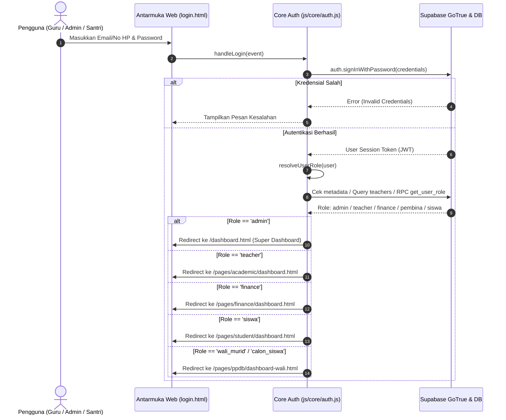
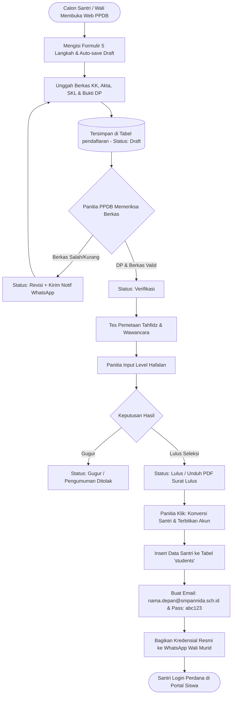
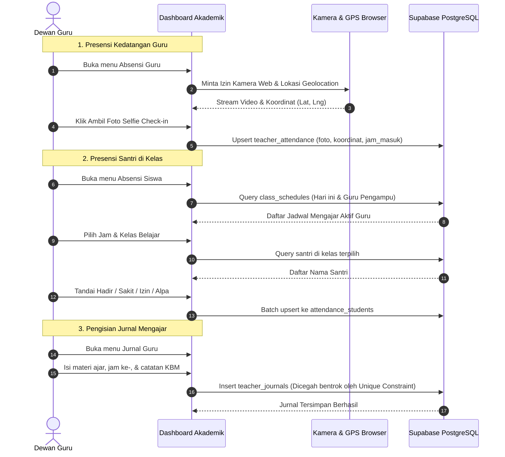
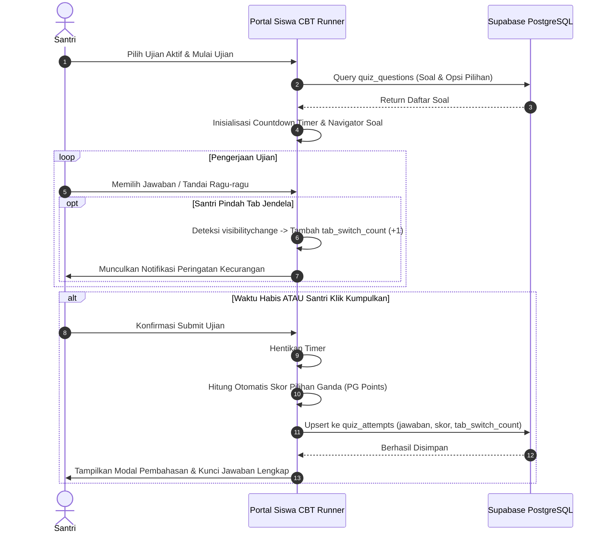
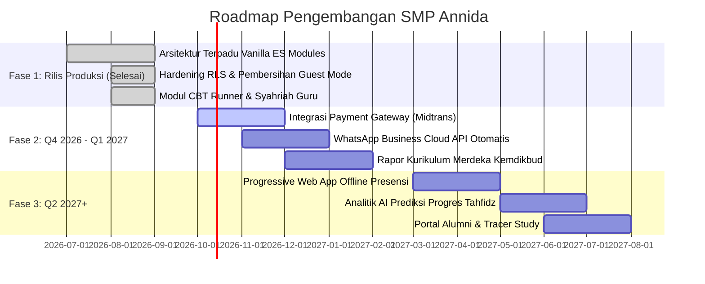

# Product Requirements Document (PRD)
# Sistem Informasi Manajemen Terpadu SMP Annida

**Versi Dokumen:** 1.0.0  
**Tanggal Rilis:** 29 September 2026  
**Status Dokumen:** Approved / Production Baseline  
**Penulis:** Tim Dokumentasi Teknis SMP Annida  
**Target Repository:** `C:\Users\ThinkPad\Projects\SMPAnnida`

---

## Daftar Isi
1. [Ringkasan Produk (Product Summary)](#1-ringkasan-produk-product-summary)
2. [Tujuan & Latar Belakang](#2-tujuan--latar-belakang)
3. [Target Pengguna & Matriks Hak Akses (RBAC)](#3-target-pengguna--matriks-hak-akses-rbac)
4. [Fitur Utama per Modul](#4-fitur-utama-per-modul)
   - [4.1 Modul Akademik & Kesiswaan](#41-modul-akademik--kesiswaan)
   - [4.2 Modul Keuangan (Finance & Budgeting)](#42-modul-keuangan-finance--budgeting)
   - [4.3 Modul PPDB (Penerimaan Peserta Didik Baru)](#43-modul-ppdb-penerimaan-peserta-didik-baru)
   - [4.4 Modul Portal Siswa & E-Learning (CBT)](#44-modul-portal-siswa--e-learning-cbt)
   - [4.5 Modul Executive Super Dashboard](#45-modul-executive-super-dashboard)
5. [Alur Pengguna (User Flows)](#5-alur-pengguna-user-flows)
6. [Kebutuhan Non-Fungsional](#6-kebutuhan-non-fungsional)
   - [6.1 Keamanan (Security & Data Privacy)](#61-keamanan-security--data-privacy)
   - [6.2 Performa & Optimasi Aset](#62-performa--optimasi-aset)
   - [6.3 Aksesibilitas, UI/UX & Desain Responsif](#63-aksesibilitas-uiux--desain-responsif)
7. [Batasan & Ketergantungan Sistem](#7-batasan--ketergantungan-sistem)
8. [Roadmap & Rencana Pengembangan](#8-roadmap--rencana-pengembangan)

---

## 1. Ringkasan Produk (Product Summary)

**SMP Annida Integrated System** adalah sistem informasi manajemen sekolah berbasis web modern yang dirancang khusus untuk operasional terpadu **SMP An-Nida Al-Islamy Setu** (Sekolah Alam & Pesantren Tahfidz). Sistem ini mengintegrasikan seluruh lini operasional pendidikan mulai dari penerimaan santri baru (PPDB daring), pengelolaan kurikulum dan absensi akademik, tata kelola keuangan dan penggajian guru (Syahriah), hingga portal pembelajaran mandiri (LMS & Computer-Based Testing / CBT) bagi para santri.

### Arsitektur Inti Produk
- **Frontend Layer:** Vanilla JavaScript berorientasi ES Modules (`import`/`export`), HTML5 semantik, CSS3 modular dengan custom Glassmorphism UI tokens tanpa dependensi framework CSS eksternal yang membebani browser.
- **Backend & Database Layer:** Serverless Architecture memanfaatkan platform **Supabase** (PostgreSQL 15+, GoTrue Auth Provider, PostgREST API, Realtime Subscriptions, dan Supabase Storage bucket).
- **Security & Authorization:** Enforced **Row Level Security (RLS)** pada 100% tabel publik database PostgreSQL yang dikombinasikan dengan fungsi pembantu `SECURITY DEFINER` anti-rekursif (`is_admin()`, `get_my_role()`, `is_staff()`).
- **Build & Bundler Tool:** **Vite 8.x** dengan konfigurasi Multi-Page Application (MPA) dinamis, chunking vendor manual (`vendor-supabase`, `vendor-charts`, `vendor-xlsx`, `vendor-jspdf`, `vendor-crypto`), serta mekanisme pre-load partial templates.

---

## 2. Tujuan & Latar Belakang

### 2.1 Latar Belakang Masalah
Sebelum implementasi sistem terintegrasi ini, SMP An-Nida menghadapi beberapa tantangan operasional:
1. **Fragmentasi Data:** Data siswa baru tersimpan di formulir fisik/Google Forms, pencatatan keuangan berada di buku kas fisik/spreadsheet terpisah, dan absensi harian dicatat manual di lembar kertas kelas.
2. **Risiko Kebocoran dan Integritas Data:** Pencatatan manual rawan manipulasi, duplikasi entri nilai/jadwal mengajar, dan ketidaksesuaian laporan kas masuk dan keluar.
3. **Komunikasi PPDB yang Tidak Efisien:** Orang tua calon santri kesulitan memantau tahapan seleksi berkas, jadwal tes pemetaan tahfidz, serta status pelunasan uang komitmen awal (DP).
4. **Kebutuhan Evaluasi Mandiri Santri:** Santri membutuhkan platform digital terpusat untuk melihat rekapitulasi setoran hafalan Quran, materi bahan ajar multimedia, dan pelaksanaan ujian terstandarisasi berbasis komputer (CBT).

### 2.2 Tujuan Utama Proyek
- **Sentralisasi Data Master:** Menyatukan data siswa, dewan guru, kelas, mata pelajaran, serta tahun ajaran ke dalam satu basis data terelasi dengan constraint anti-bentrok.
- **Transparansi & Akuntabilitas Finansial:** Memfasilitasi pembukuan kas masuk/keluar harian, monitoring alokasi RAB kelas, realisasi anggaran bulanan, serta otomatisasi slip insentif mengajar guru (Syahriah).
- **Efisiensi Alur Pendaftaran Santri Baru:** Mengurangi waktu proses verifikasi berkas PPDB dari hitungan hari menjadi hitungan menit dengan alur kerja verifikasi berkas, integrasi notifikasi WhatsApp, dan konversi instan calon santri menjadi santri aktif.
- **Digitalisasi Pembelajaran & Pengujian:** Menyediakan lingkungan belajar modern dengan pemutar video pintar, penampil dokumen PDF/HTML interaktif, serta simulator ujian CBT dengan proteksi anti-kecurangan.

---

## 3. Target Pengguna & Matriks Hak Akses (RBAC)

Aplikasi menerapkan sistem kontrol akses berbasis peran (**Role-Based Access Control / RBAC**) yang dikelola secara terpusat melalui tabel `public.user_roles`. Tidak ada lagi mode tamu (*guest mode* dihapus total per audit keamanan September 2026). Setiap pengguna wajib memiliki sesi aktif Supabase Auth yang valid.

| Peran (*Role*) | Deskripsi Pengguna | Lingkup Akses & Wewenang |
| :--- | :--- | :--- |
| **`admin`** | Administrator Sekolah / IT Superuser | Akses tak terbatas (*Full Access*) ke seluruh modul: Super Dashboard, Master Akademik, Keuangan, PPDB Admin, Pengaturan Sistem, Manajemen Pengguna, Migrasi Data. |
| **`teacher`** | Dewan Guru & Tenaga Pengajar | Mengisi presensi kehadiran guru (Webcam selfie + GPS), menginput presensi siswa sesuai jadwal mengajar, mencatat Jurnal Pembelajaran harian, memasukkan nilai siswa, mengakses jadwal mengajar pribadi, serta melihat rincian slip gaji (Syahriah) pribadi. Akses ke menu Keuangan umum dan PPDB disembunyikan. |
| **`pembina`** | Pembina Yayasan / Pengawas Eksekutif | Hak akses *Read-Only* (Pengawasan Tingkat Tinggi). Dapat meninjau dashboard akademik, data santri, jurnal guru, seluruh transaksi keuangan, serapan anggaran, dan rekapitulasi gaji guru tanpa izin manipulasi data (tombol edit, hapus, dan simpan dinonaktifkan otomatis). |
| **`finance`** | Bendahara / Staf Administrasi Keuangan | Akses penuh ke Modul Keuangan: Transaksi Kas (Pemasukan/Pengeluaran), Alokasi Budgeting, RAB Kegiatan, Laporan Keuangan Neraca & Arus Kas, dan Penggajian Syahriah Guru. Akses ke modul akademik teknis dibatasi. |
| **`panitia_ppdb`** | Panitia Penerimaan Santri Baru | Akses ke Portal Admin PPDB: Memverifikasi dokumen calon siswa (KK, Akta, Ijazah), memvalidasi bukti pembayaran DP, menginput hasil tes pemetaan Tahfidz, merubah status kelulusan, mengirim notifikasi WhatsApp otomatis, serta mengonversi pendaftar menjadi santri aktif. |
| **`wali_murid`** | Orang Tua / Wali Calon Siswa & Siswa | Mengakses Portal Pendaftar PPDB: Melengkapi formulir bertahap, mengunggah berkas persyaratan, mengunggah bukti bayar, memantau timeline pendaftaran, mencetak Surat Keterangan Lulus (PDF), dan menggunakan hak penghapusan data mandiri (*Right to Erasure*). |
| **`calon_siswa` / `siswa`** | Santri Aktif SMP Annida | Mengakses Portal Siswa: Memantau jadwal pelajaran harian/mingguan, melihat histori presensi, mempelajari materi e-learning multimedia, mengerjakan kuis/ujian CBT dengan pelacak kecurangan, memantau pencapaian Tahfidz, dan melihat rapor. |

### Matriks Otorisasi RLS & Antarmuka

| Modul / Fitur | admin | teacher | pembina | finance | panitia_ppdb | wali_murid | siswa |
| :--- | :---: | :---: | :---: | :---: | :---: | :---: | :---: |
| **Super Dashboard** | CRUD | - | R | - | - | - | - |
| **Master Akademik (CRUD)** | CRUD | R | R | - | - | - | - |
| **Presensi Guru Mandiri** | CRUD | CRUD | R | - | - | - | - |
| **Presensi Siswa per Jam** | CRUD | CRUD* | R | - | - | - | R** |
| **Jurnal Mengajar Guru** | CRUD | CRUD* | R | - | - | - | R** |
| **Input Nilai & Rapor** | CRUD | CRUD | R | - | - | - | R** |
| **Data Migration (Bulk)** | CRUD | - | - | - | - | - | - |
| **Transaksi Kas & Budget** | CRUD | - | R | CRUD | - | - | - |
| **RAB Perencanaan** | CRUD | - | R | CRUD | - | - | - |
| **Laporan Finansial** | CRUD | - | R | CRUD | - | - | - |
| **Syahriah Guru (Slip Gaji)** | CRUD | R*** | R | CRUD | - | - | - |
| **PPDB Admin Panel** | CRUD | - | R | - | CRUD | - | - |
| **PPDB Formulir Pendaftar** | CRUD | - | - | - | - | CRUD* | - |
| **Konversi Akun Siswa** | CRUD | - | - | - | CRUD | - | - |
| **Portal Siswa (LMS/CBT)** | CRUD | - | - | - | - | - | CRUD* |

*\* Terbatas pada kelas, jam mengajar, atau data milik sendiri.*  
*\*\* Read-only untuk data santri yang sedang login.*  
*\*\*\* Guru hanya dapat melihat slip miliknya sendiri.*

---

## 4. Fitur Utama per Modul

### 4.1 Modul Akademik & Kesiswaan
Modul akademik melayani kebutuhan operasional kegiatan belajar mengajar (KBM) harian yang diatur dalam SPA modular berarsitektur partial HTML di `pages/academic/dashboard.html`:

1. **Master Data Siswa (`js/academic/siswa.js`):**
   - Pencatatan identitas lengkap santri (NISN, NIS, Nama Lengkap, Jenis Kelamin, Tanggal Lahir, Kelas, Alamat, Kontak Orang Tua, Status Aktif).
   - Server-side filter dan paginasi (20 item per halaman) dengan pencarian teks dinamis.
   - Manajemen mutasi dan penonaktifan santri.
2. **Master Data Dewan Guru (`js/academic/guru.js`):**
   - Manajemen profil tenaga pendidik (NIP, Nama Lengkap, Email resmi `@smpannida.sch.id`, No HP, Status Kepegawaian, Mata Pelajaran Utama).
   - Sinkronisasi akun autentikasi guru berbasis domain sekolah.
3. **Master Kelas & Mata Pelajaran (`kelas.js` & `mapel.js`):**
   - Pendataan rombongan belajar (Kelas 7A, 7B, 8, 9), penugasan wali kelas, dan kapasitas ruangan.
   - Master mata pelajaran, Kriteria Ketuntasan Minimal (KKM), dan alokasi jam tatap muka mingguan.
4. **Penjadwalan Pelajaran Anti-Bentrok (`js/academic/jadwal.js`):**
   - Penjadwalan jadwal mingguan (Senin–Sabtu) berbasis relasi tahun ajaran, kelas, guru pengajar, mapel, dan ruang kelas.
   - **Database Unique Constraints:** Mencegah bentrok jadwal dua guru mengajar di jam/hari yang sama atau satu kelas memiliki dua mapel bersamaan (`class_schedules_unique_class_time` & `class_schedules_unique_teacher_time`).
5. **Presensi Guru Berbasis Geolocation & Selfie Webcam (`js/academic/teacher-attendance.js`):**
   - Guru melakukan check-in dan check-out menggunakan foto kamera web langsung (*live selfie capture* via HTML5 Canvas) dan koordinat GPS perangkat (*Latitude & Longitude*).
   - Validasi jam kerja masuk dan pulang otomatis dengan ringkasan rekapitulasi harian bagi pihak pimpinan.
6. **Presensi Siswa per Jam Pelajaran Terintegrasi (`js/academic/attendance.js`):**
   - Absensi dilakukan per sesi mengajar guru berdasarkan jadwal pelajaran hari ini.
   - Guru hanya dapat membuka absensi untuk kelas dan jam yang sedang dia ampu.
   - Status presensi siswa: **Hadir**, **Sakit**, **Izin**, dan **Alpa** disertai catatan kasus.
   - Batch insert/upsert ke tabel `attendance_students`.
7. **Jurnal Mengajar Harian Guru (`js/academic/jurnal.js`):**
   - Rekam aktivitas belajar mengajar di kelas mencakup: Jam Ke-, Kompetensi Dasar / Materi yang Diajarkan, dan Catatan Perkembangan Siswa/Kelas.
   - Database constraint anti-duplikasi jurnal (`teacher_journals_unique_entry`).
   - Fitur ekspor histori jurnal ke format Excel/Cetak.
8. **Penilaian Siswa & Rapor Digital (`js/academic/nilai.js` & `dashboard.js`):**
   - Entri nilai per komponen: Tugas Harian, Ulangan Harian (UH), Ujian Tengah Semester (UTS), dan Ujian Akhir Semester (UAS).
   - Filter dinamis per semester (Ganjil/Genap) dan tahun ajaran aktif.
   - Rekapitulasi kartu hasil studi dan transkrip rapor santri.
9. **Bulk Data Migration Hub (`js/academic/migration.js`):**
   - Impor massal data Master Guru, Siswa, Kelas, dan Mapel menggunakan parser PapaParse.
   - Pilihan penanganan duplikasi: *Skip (Lewati)*, *Update (Perbarui)*, atau *Fail on Error*.
   - Live progress bar dan jendela log hasil impor baris-per-baris.

---

### 4.2 Modul Keuangan (Finance & Budgeting)
Modul keuangan dikelola melalui Single Page Application di `pages/finance/dashboard.html` dengan controller utama `js/finance/entry.js`:

1. **Pencatatan Transaksi Kas Masuk & Keluar (`transactions.js`):**
   - Pencatatan transaksi real-time dengan pemilihan tipe (*Income / Expense*), kategori belanja, jumlah nominal, tanggal transaksi, deskripsi, dan sumber dana (*Kas Tunai*, *Rekening Bank*, *Dana Yayasan*).
   - Dynamic Currency Input Helper: Menampilkan pratinjau nominal Rupiah berformat (`Rp ...`) saat pengguna mengetik angka di form input.
   - Pagination cerdas, pencarian deskripsi, filter kategori, dan filter periode bulan transaksi.
2. **Bulk Import Transaksi Excel (`import.js`):**
   - Unduh template standar transaksi (.xlsx) menggunakan SheetJS (`xlsx`).
   - Parsing file Excel di sisi klien, validasi format tanggal dan kategori, dilanjutkan dengan batch bulk insert ke PostgreSQL.
3. **Manajemen Anggaran Bulanan / Budgeting (`budget.js`):**
   - Penetapan plafon anggaran per kategori belanja setiap bulannya.
   - Perhitungan real-time antara alokasi anggaran vs realisasi serapan pengeluaran aktual.
   - Indikator visual progres serapan (progress bar) dan penanda otomatis status *Overbudget*.
4. **Perencanaan RAB Kelas (`rab.js`):**
   - Perancangan Rencana Anggaran Biaya (RAB) kegiatan operasional kelas dan santri selama satu semester/tahun ajaran.
5. **Laporan Finansial & Visualisasi Grafik (`reports.js` & `charts.js`):**
   - Visualisasi tren arus kas bulanan menggunakan pustaka Chart.js.
   - Diagram lingkaran (*Pie Chart*) distribusi pengeluaran berdasarkan kategori.
   - Ekspor laporan neraca dan buku kas ke format cetak PDF via jsPDF & HTML2Canvas, serta format lembar kerja Excel via XLSX-js-style.
6. **Sistem Penggajian / Syahriah Guru (`syahriah.js`):**
   - Perhitungan hak keuangan guru bulanan berbasis komponen: Gaji Pokok, Tunjangan Jabatan/Wali Kelas, Insentif Jam Tatap Muka (berdasarkan kehadiran di Jurnal/Absensi).
   - Siklus status slip gaji: `Draft` -> `Finalized` -> `Paid`.
   - Cetak slip gaji personal digital bagi masing-masing dewan guru.

---

### 4.3 Modul PPDB (Penerimaan Peserta Didik Baru)
Modul PPDB melayani pendaftaran daring calon santri baru untuk jalur Sekolah Reguler maupun Pesantren Tahfidz (`Boarding School`):

1. **Landing Page Publik & Informasi Program (`pages/ppdb/index.html` & `about.html`):**
   - Penjelasan profil sekolah, keunggulan kurikulum alam & tahfidz, fasilitas pondok, rincian biaya pendaftaran, dan informasi kontak.
2. **Formulir Pendaftaran Multi-Step (`pages/ppdb/register.html`):**
   - Form pendaftaran bertahap dengan progress wizard:
     - **Langkah 1:** Pemilihan Jalur (Reguler / Boarding) & Pembuatan Akun Akses.
     - **Langkah 2:** Biodata Calon Santri (NIK, NISN, TTL, Alamat).
     - **Langkah 3:** Data Orang Tua / Wali (Nama Ayah/Ibu, Pekerjaan, Kontak WhatsApp).
     - **Langkah 4:** Riwayat Sekolah Asal & NPSN.
     - **Langkah 5:** Pengunggahan Berkas Syarat Awal.
3. **Auto-Save Draft Formulir (`js/ppdb/draft.js`):**
   - Mekanisme penyimpanan formulir otomatis ke `localStorage` secara debounced saat wali murid mengisi data, menghindari kehilangan data jika koneksi terputus tiba-tiba.
4. **Enkripsi Data Sensitif (Client-side AES):**
   - Enkripsi data NIK siswa menggunakan pustaka `CryptoJS.AES` sebelum dikirimkan ke basis data Supabase untuk mematuhi regulasi privasi perlindungan data pribadi.
5. **Portal Wali Murid & Timeline Status (`pages/ppdb/dashboard-wali.html`):**
   - Tampilan interaktif pelacak tahapan pendaftaran santri:
     Draft -> Menunggu DP -> Verifikasi Berkas -> Seleksi Tahfidz -> Kelulusan
   - Konfirmasi pembayaran DP komitmen awal pendaftaran (Rp 250.000 untuk Reguler, Rp 500.000 untuk Boarding).
   - Banner peringatan revisi berkas dinamis jika ada dokumen yang ditolak panitia.
   - Cetak Surat Keterangan Lulus (SKL) resmi berformat PDF via `html2pdf`.
   - **GDPR Right to Erasure:** Tombol penghapusan akun dan seluruh berkas pendaftaran mandiri melalui pemanggilan RPC `delete_my_account`.
6. **Portal Verifikasi Panitia PPDB (`pages/ppdb/dashboard-admin.html` & `js/ppdb/db.js`):**
   - Tabel kendali seluruh berkas pendaftar baru dengan filter pencarian dan KPI pendaftaran.
   - Antarmuka verifikasi pratinjau berkas digital (KK, Akta Kelahiran, SKL) dengan opsi tindakan: **Setujui** atau **Minta Revisi** (disertai catatan kekurangan dokumen).
   - Penilaian tes pemetaan Tahfidz (input capaian juz dan kelancaran tajwid).
   - Ekspor seluruh data pendaftar ke spreadsheet Excel dengan sekali klik.
   - **WhatsApp Gateway Otomatis (Client-side):** Pembuatan tautan URL pesan WhatsApp dinamis (`wa.me`) dengan format pesan resmi untuk mengabarkan status revisi maupun kelulusan ke nomor telepon orang tua.
   - **Konversi Santri Baru & Penerbitan Akun Portal Siswa:**
     - Mengubah pendaftar berstatus *Lulus* menjadi santri terdaftar di tabel `students`.
     - Pemetaan rombel kelas awal (7A / 7B) dan penetapan nomor induk santri (NIS).
     - Otomasi pembuatan akun login Portal Siswa dengan email sekolah berbasis nama santri (`nama.depan@smpannida.sch.id`), kata sandi awal default, dan modal salin kredensial untuk dibagikan via WhatsApp.

---

### 4.4 Modul Portal Siswa & E-Learning (CBT)
Portal santri mandiri yang dirancang intuitif dan ramah perangkat bergerak di `pages/student/dashboard.html` dengan controller `js/student/dashboard.js`:

1. **Beranda & Profil Santri:**
   - Kartu santri digital, status kelas aktif, NISN, serta ringkasan jadwal pelajaran hari ini.
   - Modal paksaan penggantian kata sandi (*forced password reset*) pada akses perdana jika bendera `must_change_password` aktif.
2. **Jadwal Pelajaran Interaktif:**
   - Visualisasi jadwal mingguan lengkap (Senin–Sabtu) yang memuat nama mata pelajaran, ruangan belajar, jam pelajaran, dan nama guru pengampu.
3. **Presensi Siswa Mandiri:**
   - Rekapitulasi histori kehadiran siswa dalam 30 pertemuan terakhir per mata pelajaran.
   - Badge persentase tingkat kehadiran santri secara kumulatif.
4. **E-Learning & Modul Ajar Multimedia (`js/student/materi.js`):**
   - Feed materi digital yang difilter otomatis berdasarkan rombel kelas santri (misal: "7A", "Kelas 7", atau materi "Semua Kelas").
   - **Smart Media Viewer Modal:**
     - Pemutar video YouTube otomatis (mengonversi URL biasa menjadi format embed aman `youtube.com/embed/...`).
     - Penampil dokumen PDF terintegrasi langsung dalam modal tanpa unduh manual.
     - Penampil simulasi materi berbasis kode HTML interaktif.
     - Penampil infografis dan visual gambar beresolusi tinggi.
5. **Computer-Based Testing (CBT) & Kuis Daring:**
   - Pelaksanaan ujian daring terstruktur:
     - Countdown timer ujian interaktif dengan pengumpulan otomatis ketika waktu habis.
     - Panel navigator soal (menampilkan nomor soal, status belum/sudah dijawab, dan nomor aktif).
     - Tombol **Ragu-ragu** untuk menandai soal yang ingin ditinjau kembali.
     - **Anti-Cheat Detection:** Pelacak pengalihan tab jendela browser (*tab switch counter*). Setiap kali santri keluar dari layar ujian, sistem mencatat jumlah pelanggaran ke dalam riwayat ujian.
     - **Automated Scoring:** Penilaian otomatis seketika untuk tipe soal pilihan ganda (*multiple choice*).
     - **Modal Hasil & Pembahasan:** Menampilkan skor total, jumlah jawaban benar/salah, total switch tab, serta pembahasan kunci jawaban setiap butir soal setelah ujian selesai dikumpulkan.
6. **Tahfidz Progress Tracker:**
   - Riwayat pencatatan setoran hafalan Al-Qur'an santri mencakup nama surat, rentang ayat, tanggal setoran, dan predikat penilaian dari guru pembimbing tahfidz.
7. **Transkrip Nilai & Rapor Santri:**
   - Tampilan kartu nilai digital per mata pelajaran untuk evaluasi berkala santri dan orang tua.

---

### 4.5 Modul Executive Super Dashboard
Antarmuka pimpinan eksekutif (`dashboard.html` & `js/core/dashboard.js`) yang mengagregasi data lintas modul:
- **Total Siswa Aktif:** Dihitung otomatis dari tabel `students`.
- **Saldo Kas Sekolah Bersih:** Akumulasi real-time seluruh transaksi masuk dikurangi transaksi keluar dari tabel `transactions`.
- **Total Pendaftar PPDB:** Metrik terkini volume calon santri baru yang masuk sistem.
- **Estimasi Piutang SPP (Open Amount):** Proyeksi piutang iuran sekolah santri.
- **Grafik Tren Arus Kas & Sparklines:** Visualisasi ringkas performa keuangan bulanan.
- **Daftar Pendaftar PPDB Terkini:** Feed tabel pendaftar terbaru yang memerlukan atensi panitia verifikator.

---

## 5. Alur Pengguna (User Flows)

### 5.1 Alur Autentikasi & Resolusi Peran (Role Resolution)

---

### 5.2 Alur PPDB: Pendaftaran hingga Penerbitan Akun Santri

---

### 5.3 Alur KBM & Presensi Terpadu Guru & Siswa

---

### 5.4 Alur Santri Mengerjakan Ujian CBT Daring

---

## 6. Kebutuhan Non-Fungsional

### 6.1 Keamanan (Security & Data Privacy)
1. **Eliminasi Total Akun Tamu (*No Guest Mode*):**
   Berdasarkan audit keamanan 27 September 2026, seluruh panel operasional (Akademik, Keuangan, PPDB Admin, Portal Siswa, Super Dashboard) diproteksi secara mutlak oleh fungsi penjaga `requireAuth()`. Akses anonim hanya diizinkan pada halaman landing statis dan formulir registrasi awal.
2. **PostgreSQL Row Level Security (RLS) Menyeluruh:**
   - Seluruh tabel publik PostgreSQL memiliki RLS aktif.
   - Pengecekan otorisasi menggunakan helper functions anti-rekursi `SECURITY DEFINER`:
     - `public.is_admin()`: Memvalidasi apakah token JWT adalah superadmin.
     - `public.get_my_role()`: Mengambil peran pengguna saat ini secara stabil.
     - `public.is_staff()`: Memvalidasi staf internal sekolah (`admin`, `teacher`, `finance`, `pembina`, `panitia_ppdb`).
3. **Pencegahan Cross-Site Scripting (XSS):**
   - Segala injeksi data dinamis ke DOM wajib melewati fungsi sanitasi terpusat pada `js/core/utils.js`:
     - `escapeHTML(str)`: Menetralisir karakter bahaya (`<`, `>`, `&`, `"`, `'`).
     - `escapeAttr(str)`: Menetralisir nilai atribut HTML tag.
4. **Content Security Policy (CSP) & Header Pengaman:**
   - Meta tag CSP defensif disematkan di semua dokumen HTML utama, membatasi pemanggilan skrip hanya dari domain tepercaya (`'self'`, Google Fonts, CDN esensial, dan endpoint resmi Supabase).
   - Penggunaan header `X-Content-Type-Options: nosniff`.
5. **Inactivity Auto-Logout:**
   - Pemantau aktivitas pengguna (`mousemove`, `keydown`, `scroll`, `click`) dengan batas toleransi idle selama 30 menit (1.800.000 ms). Pengguna yang tidak aktif otomatis di-logout untuk mencegah pembajakan sesi di komputer bersama sekolah.
6. **Enkripsi Klien untuk NIK Santri:**
   - Enkripsi simetris berbasis CryptoJS AES-256 pada data Nomor Induk Kependudukan (NIK) sebelum masuk ke database publik.
7. **Database Unique Constraints Anti-Bentrok:**
   - Integritas data level mesin PostgreSQL:
     - `teacher_journals_unique_entry` pada `(date, class_id, jam_pelajaran)`.
     - `class_schedules_unique_class_time` pada `(academic_year_id, class_id, day_of_week, start_time)`.
     - `class_schedules_unique_teacher_time` pada `(academic_year_id, teacher_id, day_of_week, start_time)`.

### 6.2 Performa & Optimasi Aset
1. **Bundler & Code Splitting (Vite 8.x):**
   - Konfigurasi `manualChunks` memecah pustaka berukuran besar menjadi file chunk terpisah:
     - `vendor-supabase` (`@supabase/supabase-js`)
     - `vendor-charts` (`chart.js`)
     - `vendor-xlsx` (`xlsx`, `xlsx-js-style`)
     - `vendor-jspdf` (`jspdf`)
     - `vendor-html2canvas` (`html2canvas`)
     - `vendor-crypto` (`crypto-js`)
     - `vendor-utils` (`papaparse`, `dompurify`)
2. **Lazy Loading Partials Modul Akademik:**
   - Konten partial tab akademik (`absensi.html`, `nilai.html`, `jurnal-guru.html`, dll.) di-load melalui HTTP fetch hanya ketika hash rute URL dipanggil pengguna pertama kali, meminimalkan initial payload loading.
3. **PWA & Cache Kill-Switch:**
   - Skrip inline pembasmi service worker lama di setiap header HTML untuk menjamin pengguna selalu menerima pembaruan berkas JS/CSS terbaru tanpa tersangkut di cache lawas.
4. **Optimasi Font & Aset Gambar:**
   - Penggunaan format logo WebP (`assets/logo/1.webp`), Google Material Symbols Outlined, serta preloading font `Literata` dan `Nunito Sans`.

### 6.3 Aksesibilitas, UI/UX & Desain Responsif
1. **Split Rail Navigation Bar:**
   - Desain tata letak desktop dua lapis:
     - **Lapisan 1 (52px Icon Rail):** Ikon kategori modul utama (*Main, Academic, Finance, PPDB, System*).
     - **Lapisan 2 (200px Context Submenu Panel):** Daftar submenu navigasi kontekstual dengan pencarian cepat (*Ctrl+K*).
2. **Mobile Drawer Navigation:**
   - Transisi geser responsif di layar <= 1024px dengan pelindung backdrop overlay.
   - Penutupan otomatis drawer (*auto-close*) terpadu via listener: saat menu diklik, layar di-resize, rotasi perangkat, maupun saat tombol *Escape* ditekan.
3. **Manajemen Layering Z-Index Terstandarisasi:**
   - Token CSS global: `--z-sidebar: 1200` dan `--z-overlay: 9999` pada `css/theme.css` dan `css/mobile.css` mencegah bug elemen antarmuka yang saling bertumpuk.
4. **Tema Gelap & Terang Terpadu (Theming):**
   - Dukungan Dark Mode dan Light Mode instan dengan sinkronisasi ke `localStorage` tanpa kedipan visual saat refresh (*FOUC mitigation*).

---

## 7. Batasan & Ketergantungan Sistem

### 7.1 Ketergantungan Teknologi (Dependencies)
- **Runtime Frontend:** ES6+ Vanilla JavaScript Module System (Browser modern: Chromium >= 90, Firefox >= 88, Safari >= 14).
- **Tooling Build:** Vite 8.2.1, PostCSS 8.5, TailwindCSS 3.4.19, Autoprefixer 10.5.
- **Pustaka Pihak Ketiga Inti:**
  - `@supabase/supabase-js` (v2.112.3) - Backend BaaS client.
  - `chart.js` (v4.5.1) - Visualisasi data analitik dan grafik tren.
  - `xlsx` (v0.18.5) & `xlsx-js-style` (v1.2.0) - Manipulasi & styling spreadsheet Excel.
  - `jspdf` (v4.2.1) & `html2pdf.js` - Generator dokumen cetak PDF.
  - `papaparse` (v5.6.0) - Parser CSV untuk fitur Data Migration.
  - `crypto-js` (v4.2.0) - Enkripsi AES data NIK pendaftar.
  - `@sentry/browser` (v11.0.0) & `logrocket` (v12.4.0) - Opsional crash reporting & user telemetry.
  - `vitest` (v5.0.2) - Pengujian unit test dan policy integrity test.

### 7.2 Batasan Sistem (Limitations)
1. **Serverless Static Hosting:**
   Aplikasi dirancang sebagai SPA statis murni yang di-host di layanan seperti Vercel, Netlify, atau GitHub Pages. Seluruh komputasi logika server dan validasi data bergantung penuh pada fitur PostgreSQL Database, RPC Stored Procedures, dan RLS Supabase.
2. **Ketergantungan Klien WhatsApp:**
   Fitur pengiriman notifikasi pendaftaran PPDB menggunakan skema URI klien `https://wa.me/?text=...` (memerlukan persetujuan panitia untuk membuka jendela WhatsApp Web/Aplikasi), belum menggunakan WhatsApp Business Cloud API berbasis webhooks otomatis.
3. **Kapasitas Kuota Pendaftaran Percobaan:**
   Terdapat guard pembatas kuota 5 akun pendaftar publik pada form registrasi awal untuk keamanan uji coba/demo sebelum sistem resmi dibuka penuh per gelombang.
4. **Konektivitas Internet:**
   Operasional aplikasi membutuhkan koneksi internet aktif untuk berkomunikasi dengan endpoint Supabase REST/GraphQL/Storage.

---

## 8. Roadmap & Rencana Pengembangan

### Rincian Rencana Pengembangan
- **Fase 1 (Selesai - Baseline Versi 1.0.0):**
  - Implementasi penuh 4 modul utama (Akademik, Keuangan, PPDB, Portal Siswa).
  - Penghapusan total mode tamu dan penguatan PostgreSQL Row Level Security pada seluruh tabel.
  - Implementasi navigasi Split Rail responsif dan optimasi build bundler Vite.
- **Fase 2 (Q4 2026 - Q1 2027: Integrasi Otomasi & Regulasi):**
  - **Payment Gateway Otomatis:** Menghubungkan pembayaran uang pendaftaran PPDB dan SPP bulanan santri dengan payment gateway resmi (Midtrans/Xendit) dengan verifikasi status pembayaran otomatis via webhook (tanpa perlu unggah bukti transfer manual).
  - **WhatsApp Official API:** Notifikasi WhatsApp transaksional langsung dikirim dari server background tanpa memerlukan klik konfirmasi manual dari panitia.
  - **Standarisasi Rapor Kurikulum Merdeka:** Format pencetakan rapor semester santri yang sepenuhnya sesuai dengan format baku Kemdikbudristek (Capaian Pembelajaran, Deskripsi Kemajuan, dan Nilai Projek P5).
- **Fase 3 (Q2 2027+: Smart School & PWA Offline):**
  - **PWA Offline Sync:** Kemampuan presensi guru dan pencatatan santri di kelas tanpa sinyal internet yang otomatis tersinkronisasi kembali saat perangkat terhubung internet.
  - **AI Learning Analytics:** Deteksi dini ketertinggalan belajar santri dan estimasi waktu kelulusan target hafalan Al-Qur'an 30 Juz santri berbasis model pembelajaran mesin sederhana.
  - **Portal Ikatan Alumni Santri:** Direktori penelusuran lulusan dan jejaring alumni SMP Annida Al-Islamy Setu.

---

*Dokumen ini merupakan spesifikasi kebutuhan produk resmi dari Sistem Informasi Terpadu SMP Annida dan berfungsi sebagai acuan baku bagi seluruh pemangku kepentingan (pengembang, pengurus yayasan, dewan guru, dan panitia sekolah).*

