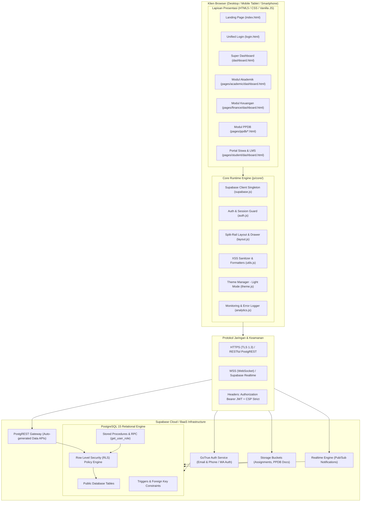
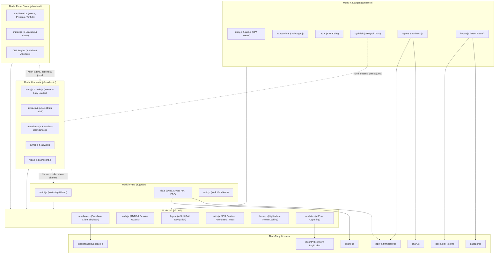
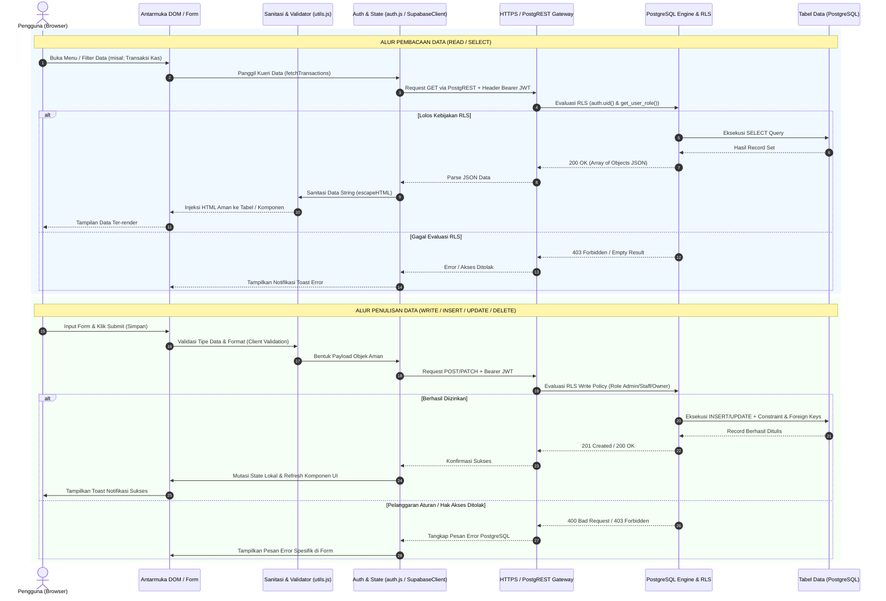
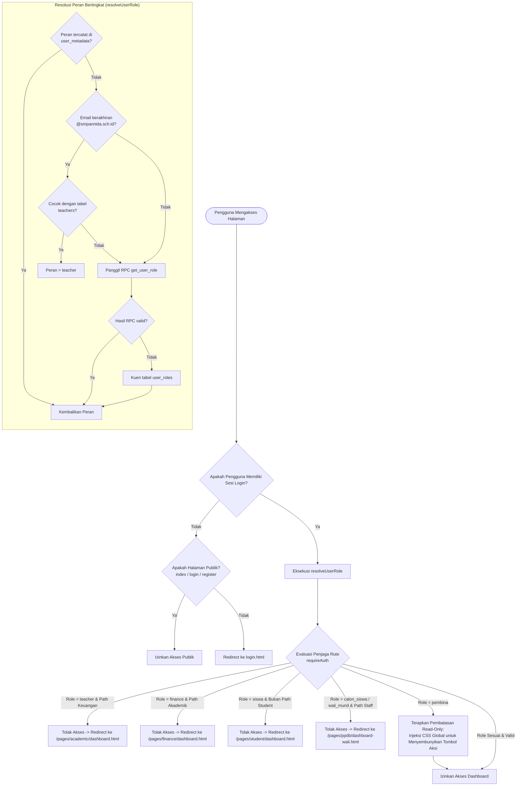
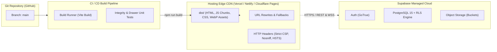

# Arsitektur Sistem SMP Annida (System Architecture Documentation)

Dokumen ini menyajikan spesifikasi arsitektur teknis lengkap untuk aplikasi manajemen sekolah berbasis web **SMP Annida (SMP An-Nida)**. Dokumen ini disusun berdasarkan analisis langsung terhadap basis kode (*codebase*), skema basis data (*database migrations*), konfigurasi build, serta implementasi keamanan sistem.

---

## Daftar Isi
1. [Arsitektur Umum (High-Level Architecture)](#1-arsitektur-umum-high-level-architecture)
2. [Struktur Direktori Proyek](#2-struktur-direktori-proyek)
3. [Modul-Modul Utama & Dependensi Antar Modul](#3-modul-modul-utama--dependensi-antar-modul)
4. [Alur Data (Data Flow Architecture)](#4-alur-data-data-flow-architecture)
5. [Sistem Autentikasi & Otorisasi (RBAC)](#5-sistem-autentikasi--otorisasi-rbac)
6. [Database Schema Overview](#6-database-schema-overview)
7. [Build System & Tooling (Vite)](#7-build-system--tooling-vite)
8. [Arsitektur Deployment & Infrastruktur](#8-arsitektur-deployment--infrastruktur)

---

## 1. Arsitektur Umum (High-Level Architecture)

Aplikasi SMP Annida mengadopsi pola arsitektur **Jamstack / Serverless Decoupled Architecture**. Sistem memisahkan secara tegas antara lapisan antarmuka pengguna (*Frontend Client-Side Application*) dan lapisan komputasi serta persistensi (*Backend-as-a-Service / BaaS*).



### Karakteristik Utama Arsitektur:
1. **Frontend Tanpa Framework Berat (Framework-less Vanilla JS)**: Menggunakan JavaScript standar modern (ES Modules) tanpa overhead runtime besar dari React/Vue/Angular, menghasilkan waktu muat halaman (*First Contentful Paint*) yang sangat cepat dan ramah perangkat dengan spesifikasi rendah.
2. **Hibrida Multi-Page Application (MPA) + Single-Page Application (SPA)**:
   - Navigasi antar modul utama (Akademik, Keuangan, PPDB, Siswa) berjalan via halaman HTML tersendiri (MPA).
   - Di dalam masing-masing modul (seperti Keuangan dan Akademik), navigasi sub-fitur berjalan secara instan melalui sistem *SPA Hash Routing* dan pemuatan komponen template secara asinkron (*lazy-loaded partials*).
3. **Backend-as-a-Service (BaaS) Supabase**:
   - **PostgREST**: Menghasilkan RESTful API instan langsung dari tabel PostgreSQL dengan skema relasional yang ketat.
   - **GoTrue Auth**: Mengelola autentikasi berbasis JSON Web Token (JWT) yang disimpan pada `localStorage` klien.
   - **Storage**: Bucket berkas berbasis S3 dengan kontrol hak akses granular (RLS objek).
4. **Keamanan Tanpa Kompromi (Zero-Trust Data Access)**: Seluruh tabel publik PostgreSQL dilindungi oleh **Row Level Security (RLS)**. Klien frontend tidak pernah diberikan *Service Role Key*; semua akses kueri dibatasi langsung oleh mesin basis data menggunakan identitas JWT pengguna (`auth.uid()`).

---

## 2. Struktur Direktori Proyek

Berikut adalah hierarki direktori proyek SMP Annida yang terorganisasi secara modular:

```text
SMPAnnida/
├── assets/                          # Aset statis media, gambar, dan identitas visual
│   ├── images/                      # Foto aktivitas sekolah (.webp, .jpg) & latar belakang
│   └── logo/                        # Logo resmi SMP Annida (1.webp, logo_1x1.png)
├── backend-gas/                     # Kode Google Apps Script (integrasi spreadsheet legacy)
│   ├── Code.js
│   └── appsscript.json
├── css/                             # Arsitektur CSS Modular & Design Tokens
│   ├── academic/                    # Stylesheet khusus modul akademik (absensi, nilai, jadwal)
│   ├── finance/                     # Stylesheet khusus modul keuangan (rab, syahriah, dashboard)
│   ├── mobile/                      # Stylesheet responsif perangkat bergerak (drawer, toolbar)
│   │   ├── drawer.css
│   │   ├── layout.css
│   │   └── toolbar.css
│   ├── ppdb/                        # Stylesheet landing page & formulir PPDB
│   ├── theme/                       # Token komponen inti tema aplikasi
│   │   ├── layout.css
│   │   ├── overlay.css
│   │   └── sidebar.css
│   ├── mobile.css                   # Aggregator stylesheet mobile
│   ├── style.css                    # Global Glassmorphism stylesheet & CSS Custom Properties
│   └── theme.css                    # Aggregator tema dasar & z-index variables
├── database/                        # Migrasi DDL SQL dan Skrip Pemeliharaan Database
│   └── migrations/                  # Kumpulan migrasi skema tabel, RLS, CBT, LMS, & Syahriah
│       ├── absensi_per_jam_migration.sql
│       ├── add_pembina_role.sql
│       ├── cbt_and_elearning_modules.sql
│       ├── hardening_rls_security.sql
│       ├── student_lms_and_assignments.sql
│       ├── student_portal_ppdb_integration.sql
│       ├── syahriah_schema.sql
│       └── ... (skrip perbaikan & patch lainnya)
├── docs/                            # Dokumentasi teknis & operasional sistem
│   ├── Architecture.md              # Dokumen Arsitektur Sistem Utama (berkas ini)
│   ├── database.md                  # Dokumentasi skema basis data & ERD
│   ├── deployment.md                # Panduan deployment (Vercel, Netlify, GH Pages)
│   ├── layout.md                    # Dokumentasi API tata letak (Layout & Drawer)
│   └── security.md                  # Panduan kepatuhan keamanan, XSS, & RLS
├── js/                              # Logika Pemrograman Frontend (ES Modules)
│   ├── core/                        # Modul Inti yang Dibagi Pakai (Shared Core)
│   │   ├── analytics.js             # Integrasi Sentry & LogRocket error tracking
│   │   ├── auth.js                  # Handler login, logout, sesi, dan route guard
│   │   ├── dashboard.js             # Agregator metrik ringkasan Super Dashboard
│   │   ├── layout.js                # Split-rail navigation, mobile drawer & topbar
│   │   ├── pwa.js                   # PWA lifecycle & service worker handler
│   │   ├── supabase.js              # Inisialisasi Supabase Client singleton
│   │   ├── telemetry.js             # Real User Monitoring (RUM) event tracker
│   │   ├── theme.js                 # Pengunci tema light-mode permanen
│   │   └── utils.js                 # Sanitasi XSS (escapeHTML), formatter uang & tanggal
│   ├── academic/                    # Logika Bisnis Modul Akademik
│   │   ├── attendance.js            # Presensi siswa per jam pelajaran
│   │   ├── authState.js             # State reaktif sesi guru & hak akses akademik
│   │   ├── dashboard.js             # Statistik & analitik kehadiran akademik
│   │   ├── entry.js                 # Bundler entry point modul akademik
│   │   ├── guru.js                  # Manajemen data direktori guru
│   │   ├── jadwal.js                # Penjadwalan mata pelajaran & ruangan
│   │   ├── jurnal.js                # Jurnal mengajar harian guru
│   │   ├── kelas.js                 # Master data rombongan belajar (kelas)
│   │   ├── main.js                  # Router SPA akademik & lazy-loader partials
│   │   ├── mapel.js                 # Master mata pelajaran
│   │   ├── migration.js             # Impor data master via CSV
│   │   ├── nilai.js                 # Penilaian formatif, sumatif & rapor
│   │   ├── siswa.js                 # Direktori & biodata siswa aktif
│   │   └── teacher-attendance.js    # Presensi guru berbasis kamera & geolokasi
│   ├── finance/                     # Logika Bisnis Modul Keuangan
│   │   ├── app.js                   # Controller dashboard keuangan & agregasi ringkasan
│   │   ├── budget.js                # Alokasi dan monitoring anggaran bulanan
│   │   ├── charts.js                # Visualisasi grafik Chart.js (Cashflow & Donut)
│   │   ├── entry.js                 # Entry point SPA router keuangan (#hash routing)
│   │   ├── import.js                # Impor batch transaksi via Excel/CSV
│   │   ├── rab.js                   # Rencana Anggaran Biaya (RAB) per kelas
│   │   ├── reports.js               # Laporan kas & generator export PDF (jsPDF)
│   │   ├── settings.js              # Preferensi keuangan & kategori transaksi
│   │   ├── syahriah.js              # Penggajian guru berbasis presensi & jam ajar
│   │   └── transactions.js          # CRUD buku kas umum & breakdown kategori
│   ├── ppdb/                        # Logika Bisnis Penerimaan Santri Baru (PPDB)
│   │   ├── auth.js                  # Autentikasi calon santri / wali murid
│   │   ├── db.js                    # Sinkronisasi data pendaftaran, verifikasi & PDF
│   │   ├── draft.js                 # Penyimpanan draft formulir lokal (offline resilience)
│   │   └── script.js                # Validasi wizard multi-step form pendaftaran
│   └── student/                     # Logika Bisnis Portal Siswa & LMS
│       ├── dashboard.js             # Controller utama portal santri (jadwal, tugas, nilai)
│       └── materi.js                # Modul materi ajar e-learning interaktif & video
├── pages/                           # Tampilan Halaman HTML per Domain
│   ├── academic/                    # Halaman Modul Akademik
│   │   ├── partials/                # Komponen HTML Template yang Dimuat secara Asinkron
│   │   │   ├── absensi-guru.html
│   │   │   ├── absensi.html
│   │   │   ├── data-guru.html
│   │   │   ├── data-migration.html
│   │   │   ├── data-siswa.html
│   │   │   ├── guru.html
│   │   │   ├── jadwal.html
│   │   │   ├── jurnal-guru.html
│   │   │   ├── kelas.html
│   │   │   ├── mata-pelajaran.html
│   │   │   ├── nilai.html
│   │   │   └── rapor.html
│   │   ├── dashboard.html           # Shell utama dashboard akademik
│   │   └── ujian.html               # Halaman antarmuka pengerjaan ujian CBT
│   ├── finance/
│   │   └── dashboard.html           # Shell utama dashboard keuangan
│   ├── ppdb/                        # Portal Calon Santri & Panitia PPDB
│   │   ├── about.html
│   │   ├── dashboard-admin.html     # Panel verifikasi berkas & kelulusan panitia PPDB
│   │   ├── dashboard-wali.html      # Panel pantau status & unduh SKL wali santri
│   │   ├── index.html               # Brosur digital & alur pendaftaran
│   │   ├── privacy-policy.html      # Kebijakan privasi data pribadi (kepatuhan UU PDP)
│   │   ├── register.html            # Formulir pendaftaran calon siswa bertahap
│   │   └── success.html             # Tanda bukti pendaftaran berhasil
│   └── student/
│       └── dashboard.html           # Dashboard terpadu portal santri & e-learning
├── supabase/                        # Konfigurasi Lingkungan Lokal Supabase CLI
│   ├── config.toml                  # Port, URL redirect, dan konfigurasi Auth Supabase
│   └── migrations/                  # Baseline migrasi Supabase CLI
├── dashboard.html                   # Super Dashboard / Portal Utama Eksekutif
├── index.html                       # Landing Page Gerbang Utama Sekolah
├── login.html                       # Halaman Login Terpadu (Unified Authentication Portal)
├── package.json                     # Konfigurasi dependensi npm & build script
└── vite.config.js                   # Konfigurasi bundler Rollup/Vite & strategi chunking
```

---

## 3. Modul-Modul Utama & Dependensi Antar Modul

Sistem SMP Annida dipecah menjadi **5 Modul Fungsional Utama**. Modul `core` bertindak sebagai lapisan fondasi yang menyediakan utilitas, tata letak, koneksi basis data, dan autentikasi untuk seluruh modul spesifik.



### Rincian Peran Masing-Masing Modul:

1. **Modul Core (`js/core/`)**:
   - `supabase.js`: Menyediakan instance tunggal (*singleton*) `supabaseClient` yang dikonfigurasi melalui *Environment Variables* Vite (`VITE_SUPABASE_URL` dan `VITE_SUPABASE_ANON_KEY`).
   - `auth.js`: Mengontrol autentikasi berbasis kredensial, normalisasi format nomor HP ke standar E.164 (`+62...`), resolusi peran hierarkis (`resolveUserRole`), penjaga rute (*route guards*), dan timer *auto-logout* setelah 30 menit tidak aktif.
   - `layout.js`: Menginjeksi navigasi modern dua tingkat (*Split-Rail Navigation Bar* 52px + *Submenu Drawer Panel* 200px), penanganan responsif drawer pada resolusi tablet/mobile (`DRAWER_BREAKPOINT = 1024px`), serta transformasi tabel menjadi format kartu pada layar sempit melalui `enhanceTablesForMobile()`.
   - `utils.js`: Menyediakan fungsi sanitasi wajib untuk memitigasi celah keamanan XSS: `escapeHTML()` untuk konten elemen dan `escapeAttr()` untuk atribut HTML, bersama helper format mata uang Rupiah (`formatCurrency()`) dan notifikasi melayang (*Toast Frosted Glass*).
   - `theme.js`: Mengunci tema aplikasi ke mode terang (*Light Mode*) secara permanen sesuai dengan `DESIGN.md`, menghapus kelas dark mode Tailwind, dan menyelaraskan warna visual Chart.js.

2. **Modul Akademik (`js/academic/` & `pages/academic/`)**:
   - Beroperasi dengan arsitektur *Dynamic Component Injection*. File `main.js` mengamati perubahan hash URL (`#data-siswa`, `#absensi`, `#jadwal`, dsb.), mengunduh berkas parsial HTML terkait dari `pages/academic/partials/`, menyisipkannya ke dalam DOM, lalu memanggil modul logika JavaScript yang bersesuaian secara *lazy loading* via dynamic `import()`.
   - Menangani presensi siswa per jam pelajaran (*per-session attendance*), presensi kehadiran guru menggunakan kamera perangkat (*selfie check-in*) disertai tangkapan koordinat GPS geolokasi, jurnal pembelajaran harian guru, pengelompokan kelas, dan sistem input nilai/rapor.

3. **Modul Keuangan (`js/finance/` & `pages/finance/`)**:
   - Beroperasi sebagai SPA terpadu via `entry.js`. Mengelola seluruh transaksi arus kas (*Cashflow*) masuk dan keluar, pengelompokan kategori dana, alokasi anggaran bulanan (*budget spending vs actual*), serta Rencana Anggaran Biaya (RAB) per kelas.
   - **Fitur Syahriah Guru (`syahriah.js`)**: Modul penggajian otomatis yang mengintegrasikan data kehadiran fisik guru dari tabel `teacher_attendance` dan data tatap muka jam mengajar dari `teacher_journals` untuk menghasilkan rincian slip gaji bulanan berdasarkan komponen tarif baku dan *custom rate*.
   - Menyediakan fitur impor data transaksi massal dari file Excel (`.xlsx`) atau CSV menggunakan pustaka SheetJS dan PapaParse dengan validasi baris sebelum komit ke basis data.

4. **Modul PPDB (`js/ppdb/` & `pages/ppdb/`)**:
   - Menangani alur pendaftaran siswa baru secara mandiri melalui formulir multi-tahap (*wizard*): Biodata Santri, Data Orang Tua/Wali, Riwayat Sekolah Asal, dan Unggah Dokumen Persyaratan (KK, Akta Kelahiran, Ijazah).
   - **Kepatuhan Privasi Data Pribadi (UU PDP)**: NIK (Nomor Induk Kependudukan) dienkripsi secara simetris di sisi klien menggunakan algoritma AES-256 (`CryptoJS.AES`) sebelum dikirimkan ke server. Menyediakan fitur *Right to Erasure* (penghapusan akun dan data pendaftaran secara mandiri oleh calon wali santri).
   - Panel Panitia PPDB (`dashboard-admin.html`) untuk validasi berkas fisik, konfirmasi bukti pembayaran transfer, dan penentuan status kelulusan yang langsung menerbitkan Surat Keputusan Kelulusan dalam format PDF.

5. **Modul Portal Siswa & LMS (`js/student/` & `pages/student/`)**:
   - Portal mandiri untuk santri yang mengintegrasikan seluruh layanan sekolah: jadwal pelajaran harian & mingguan, riwayat presensi kelas, ringkasan jurnal materi guru, catatan setoran hafalan Al-Qur'an (Tahfidz Ziyadah dan Muraja'ah), serta nilai rapor.
   - **E-Learning & Penugasan**: Pengunduhan materi pembelajaran multimedia (video YouTube tersemat dan modul PDF), pengunggahan berkas tugas siswa ke bucket penyimpanan Supabase `student-assignments`, serta penerimaan nilai dan koreksi dari guru.
   - **CBT Online Exam (Anti-Cheat)**: Modul ujian daring interaktif dengan pengacakan soal (*shuffle questions*), pengacakan opsi jawaban, batasan durasi pengerjaan, dan pendeteksian pelanggaran perpindahan tab peramban (*tab-switch monitoring*).

---

## 4. Alur Data (Data Flow Architecture)

Sistem SMP Annida menerapkan alur data satu arah yang terstandarisasi untuk memastikan integritas, validasi, dan keamanan data di setiap siklus transaksi.



### Tahapan Alur Data:
1. **Pemicu Aksi Pengguna (*User Trigger*)**: Pengguna mengisi formulir atau memicu filter data pada antarmuka pengguna.
2. **Sanitasi Sisi Klien (*Client-Side Sanitization*)**: Nilai masukan dibersihkan dari karakter berbahaya dan diformat (misal: normalisasi nomor ponsel ke format internasional E.164, pembersihan spasi, pengujian ekspresi reguler).
3. **Penyematan Konteks Kredensial (*JWT Context Injection*)**: Library klien Supabase secara otomatis mengambil token JWT yang masih valid dari penyimpanan peramban dan menyematkannya ke dalam header permintaan HTTP: `Authorization: Bearer <JWT_TOKEN>`.
4. **Transmisi Jaringan Aman (*Transport Layer*)**: Permintaan dikirim melalui protokol terenkripsi TLS 1.3 langsung menuju endpoint PostgREST Supabase.
5. **Evaluasi Keamanan Row Level Security (RLS)**: Mesin PostgreSQL mengekstrak `auth.uid()` dari token JWT dan mengeksekusi fungsi `get_user_role()`. Kebijakan keamanan memeriksa apakah peran atau ID pengguna berhak membaca atau memanipulasi baris data target.
6. **Eksekusi Basis Data (*Database Transaction*)**: PostgreSQL menjalankan operasi data dengan pengawasan integritas referensial (*foreign keys*, *check constraints*, dan *unique indices*).
7. **Serialisasi Respon (*Response Serialization*)**: Server merespon balik dengan representasi JSON murni.
8. **Pembaruan Reaktif DOM (*DOM Mutation & Feedback*)**: Data yang diterima dilewatkan ke fungsi sanitasi `escapeHTML()` sebelum disisipkan ke elemen DOM (`innerHTML`), memastikan aplikasi terlindung dari kerentanan *Stored XSS*. Notifikasi keberhasilan ditampilkan melalui komponen Toast.

---

## 5. Sistem Autentikasi & Otorisasi (RBAC)

Aplikasi SMP Annida mengimplementasikan sistem keamanan berlapis (*Defense-in-Depth*) yang memadukan autentikasi identitas berbasis token JWT, pemetaan peran pengguna (*Role-Based Access Control* / RBAC), penjagaan rute (*Client-Side Route Guards*), dan penegakan izin mutlak di tingkat baris basis data (*Database-Level Row Level Security*).

### Model Hierarki Peran Pengguna (User Roles)
Sistem mendefinisikan 8 peran (*roles*) dengan batasan akses yang tegas:

| Peran (*Role*) | Deskripsi & Domain Akses | Hak Akses Basis Data |
| :--- | :--- | :--- |
| **`admin`** | Administrator Sistem & Pimpinan Sekolah. Akses penuh ke seluruh modul (Akademik, Keuangan, PPDB, Siswa). | Penuh (SELECT, INSERT, UPDATE, DELETE di semua tabel). |
| **`teacher`** | Dewan Guru & Tenaga Pendidik. Mengelola presensi siswa/guru, jurnal mengajar, input nilai, jadwal, dan modul LMS CBT. | Baca & Tulis di modul Akademik & LMS; Tidak memiliki akses ke Keuangan. |
| **`pembina`** | Pengawas Yayasan / Pembina Sekolah. Hak pemantauan eksekutif untuk melihat seluruh data Akademik dan Keuangan. | **Read-Only (SELECT)** di modul Akademik dan Keuangan; Dilarang melakukan penulisan. |
| **`finance`** | Staf Tata Usaha / Bendahara Keuangan. Mengelola transaksi buku kas, alokasi anggaran, RAB, dan penggajian guru. | Baca & Tulis penuh di modul Keuangan; Tidak memiliki akses ke Akademik. |
| **`panitia_ppdb`** | Panitia Penerimaan Siswa Baru. Memverifikasi berkas pendaftaran, konfirmasi pembayaran, dan seleksi kelulusan santri. | Baca & Tulis pada klaster tabel PPDB (`pendaftaran`, `biodata_siswa`, dokumen). |
| **`siswa`** (`student`) | Santri Aktif SMP Annida. Mengakses jadwal, nilai rapor, materi e-learning, tugas, catatan tahfidz, dan CBT ujian daring. | Hanya dapat membaca dan menulis data miliknya sendiri (`user_id = auth.uid()`). |
| **`calon_siswa`** / **`wali_murid`** | Calon Santri / Orang Tua Pendaftar. Mengisi formulir PPDB, memantau verifikasi berkas, dan mengunduh bukti kelulusan. | Hanya dapat mengakses data pendaftaran miliknya sendiri. |

### Diagram Alur Resolusi Peran & Guarding Rute



### Mekanisme Pengamanan Khusus Peran Pembina (Read-Only Enforcement)
Untuk peran `pembina`, antarmuka secara otomatis menyuntikkan deklarasi CSS ke dalam `<head>` yang melenyapkan seluruh tombol mutasi data di seluruh modul akademik dan keuangan:
```javascript
if (_pembina) {
    const style = document.createElement('style');
    style.textContent = `
        .action-cell, .action-buttons, .td-aksi, .th-aksi, [data-action="edit"], [data-action="delete"] { display: none !important; }
        button[onclick*="add"], button[onclick*="edit"], button[onclick*="delete"], 
        button[onclick*="save"], button[type="submit"], #btn-tambah { display: none !important; }
    `;
    document.head.appendChild(style);
}
```
*Catatan Keamanan*: Meskipun pengguna mencoba memanipulasi DOM atau menghapus stylesheet tersebut melalui Developer Tools, operasi tulis ke basis data tetap diblokir 100% oleh kebijakan RLS PostgreSQL (`get_user_role() IN ('admin', 'finance')`).

---

## 6. Database Schema Overview

Basis data SMP Annida dioperasikan pada PostgreSQL 15 di atas infrastruktur Supabase. Skema terbagi menjadi 5 klaster fungsional yang saling terhubung melalui relasi integritas referensial.

```mermaid
erDiagram
    %% Auth & User Management
    auth_users ||--o{ user_roles : "assigned to"
    auth_users ||--o| profiles : "has profile"
    auth_users ||--o| teachers : "linked to"
    auth_users ||--o| students : "linked to"

    %% Academic Cluster
    teachers ||--o{ class_schedules : "teaches"
    teachers ||--o{ teacher_journals : "creates log"
    teachers ||--o{ teacher_attendance : "records"
    classes ||--o{ students : "enrolls"
    classes ||--o{ class_schedules : "hosts"
    subjects ||--o{ class_schedules : "included in"
    students ||--o{ attendance_students : "attends"
    students ||--o{ grades : "earns"
    students ||--o{ student_tahfidz_records : "memorizes"

    %% Finance Cluster
    categories ||--o{ transactions : "categorizes"
    categories ||--o{ budgets : "allocates"
    auth_users ||--o{ transactions : "records"
    classes ||--o{ rab_plans : "budgeted for"
    salary_components ||--o{ teacher_salary_config : "defines rate"
    teachers ||--o{ teacher_salary_config : "receives configuration"
    teachers ||--o{ salary_slips : "receives slip"
    salary_slips ||--o{ salary_slip_items : "contains breakdown"

    %% PPDB Cluster
    auth_users ||--o| pendaftaran : "submits"
    pendaftaran ||--o| biodata_siswa : "contains personal data"
    pendaftaran ||--o| data_orangtua : "contains parent data"
    pendaftaran ||--o| sekolah_asal : "contains prior school"
    pendaftaran ||--o{ dokumen_pendaftar : "uploads"
    pendaftaran ||--o| students : "converts to student"

    %% LMS & CBT Cluster
    teachers ||--o{ assignments : "assigns"
    assignments ||--o{ assignment_submissions : "receives"
    students ||--o{ assignment_submissions : "submits"
    teachers ||--o{ quizzes : "authors"
    quizzes ||--o{ quiz_questions : "contains questions"
    quizzes ||--o{ quiz_attempts : "attempted via"
    students ||--o{ quiz_attempts : "takes"
    quizzes ||--o| learning_modules : "links to"
```



### Kamus Tabel Utama Berdasarkan Klaster:

#### A. Klaster Identitas & Akses Pengguna
- **`auth.users`**: Tabel internal Supabase Auth yang menyimpan identitas terotentikasi, email terenkripsi, nomor telepon, dan hash kata sandi.
- **`profiles`**: Metadata pengguna publik (nama lengkap, avatar, preferensi tema, nomor WhatsApp). Relasi `1:1` dengan `auth.users`.
- **`user_roles`**: Mengikat `user_id` ke salah satu dari 8 peran sistem dengan batasan cek integritas:
  `CHECK (role IN ('admin', 'teacher', 'student', 'pembina', 'finance', 'calon_siswa', 'panitia_ppdb', 'wali_murid'))`.

#### B. Klaster Akademik
- **`teachers`**: Master data guru (NIP, nama, kontak, email, status aktif, kepegawaian).
- **`classes`**: Master rombongan belajar (misal: 7A, 7B, 8A, 8B, 9A, 9B) beserta wali kelas.
- **`academic_years`**: Master tahun ajaran (misal: 2026/2027) dan semester (Ganjil/Genap).
- **`subjects`**: Master mata pelajaran kurikulum terpadu (Umum & Diniyah/Pesantren).
- **`class_schedules`**: Jadwal mingguan yang menghubungkan kelas, guru, mata pelajaran, jam pelajaran, dan ruangan.
- **`students`**: Master data santri aktif (NISN, NIK, nama lengkap, kelas, jenis kelamin, alamat, status aktif). Terhubung secara opsional ke `pendaftaran_id` dan `auth.users(id)`.
- **`attendance_students`**: Rekam presensi kehadiran santri (Hadir, Sakit, Izin, Alpha) yang mendukung pencatatan berbasis jam ke (*per-session attendance*).
- **`grades`**: Penilaian siswa untuk formatif, sumatif (UTS/UAS), dan kalkulasi nilai rapor akhir.
- **`teacher_journals`**: Buku jurnal mengajar harian guru berisi materi pokok yang diajarkan, jumlah siswa hadir, dan catatan evaluasi kelas.
- **`teacher_attendance`**: Log absensi kehadiran guru berbasis foto *selfie* dan koordinat lintang/bujur (geolokasi).

#### C. Klaster Keuangan & Penggajian (Syahriah)
- **`categories`**: Kategori pos anggaran pemasukan dan pengeluaran (misal: SPP, Uang Gedung, Honorarium Guru, Operasional ATK).
- **`transactions`**: Buku kas umum yang mencatat setiap mutasi keuangan (`income` / `expense`), nominal, tanggal, dan bukti transaksi.
- **`budgets`**: Batas alokasi belanja bulanan per kategori untuk mengontrol defisit pengeluaran.
- **`rab_plans`**: Rencana Anggaran Biaya kegiatan dan perlengkapan spesifik tingkat kelas.
- **`salary_components`**: Komponen standar slip gaji guru (Transport harian, Mengajar per jam/sesi, Insentif hadir, Tunjangan Kepsek, Tunjangan Wali Kelas, Tata Usaha, Mengajar Pesantren).
- **`teacher_salary_config`**: Tabel penyesuaian (*override rate*) tarif honor per guru per komponen.
- **`salary_slips` & `salary_slip_items`**: Header dan baris rincian slip gaji bulanan yang telah dikalkulasi berdasarkan presensi aktual dan jurnal mengajar.

#### D. Klaster PPDB (Penerimaan Peserta Didik Baru)
- **`pendaftaran`**: Master berkas registrasi calon siswa baru berisi nomor pendaftaran unik, jalur pendaftaran, status pendaftaran (Draft, Terverifikasi, Lulus, Ditolak), dan status pembayaran formulir.
- **`biodata_siswa`**: Biodata calon siswa. NIK disimpan dalam format terenkripsi AES-256.
- **`data_orangtua`**: Data ayah, ibu, atau wali santri (pekerjaan, penghasilan, nomor kontak).
- **`sekolah_asal`**: Asal jenjang pendidikan sebelumnya (SD/MI) beserta nomor NPSN.
- **`dokumen_pendaftar`**: Jejak unggahan berkas digital (KK, Akta Kelahiran, Ijazah) yang tersimpan di bucket Supabase Storage.

#### E. Klaster LMS, CBT Ujian Daring & Tahfidz
- **`assignments` & `assignment_submissions`**: Manajemen tugas dan materi dari guru serta pengumpulan berkas jawaban siswa.
- **`quizzes`**: Konfigurasi ujian online CBT (judul, durasi menit, opsi acak soal/jawaban, dan flag anti-cheat).
- **`quiz_questions`**: Butir soal pilihan ganda atau esai yang tersimpan dalam format JSONB.
- **`quiz_attempts`**: Hasil pengerjaan ujian santri, pencatatan skor otomatis, dan penghitung pelanggaran perpindahan jendela (*tab switch counter*).
- **`learning_modules`**: Modul pembelajaran mandiri per bab yang menyematkan video dan rangkuman materi.
- **`student_tahfidz_records`**: Buku kendali hafalan Al-Qur'an santri (tanggal, juz, surah mulai-selesai, kategori Ziyadah/Muraja'ah, dan nilai kelancaran).

---

## 7. Build System & Tooling (Vite)

Proyek ini dibangun menggunakan **Vite 8.x** sebagai *build tool* dan *bundler* berbasis Rollup. Konfigurasi didefinisikan pada berkas `vite.config.js`.

### Poin Kunci Konfigurasi Vite:

1. **Resolusi Multi-Page Application (MPA) & Lazy Partials**:
   Aplikasi memiliki banyak file HTML mandiri. Agar seluruh file parsial HTML pada modul akademik (`pages/academic/partials/*.html`) ikut disertakan dalam bundel hasil kompilasi produksi tanpa harus didaftarkan satu per satu secara manual, `vite.config.js` mengeksekusi skrip pemindaian otomatis menggunakan Node.js `fs`:
   ```javascript
   const partialsDir = resolve(root, 'pages/academic/partials');
   const partialInputs = {};
   if (fs.existsSync(partialsDir)) {
     const partialFiles = fs.readdirSync(partialsDir).filter(f => f.endsWith('.html'));
     partialFiles.forEach(file => {
       const name = file.replace('.html', '');
       partialInputs[`partial_${name}`] = resolve(partialsDir, file);
     });
   }
   ```

2. **Strategi Pemecahan Kode Manual (*Manual Chunking Strategy*)**:
   Dependensi pihak ketiga (*third-party vendor libraries*) dari `node_modules` dipecah menjadi beberapa chunk terpisah guna mengoptimalkan *browser caching*, mencegah berkas bundel utama berukuran terlalu besar (*monolithic bundle bloat*), dan menurunkan waktu rendering awal:

   ```javascript
   output: {
     manualChunks(id) {
       if (id.includes('node_modules')) {
         if (id.includes('@supabase')) return 'vendor-supabase';
         if (id.includes('chart.js')) return 'vendor-charts';
         if (id.includes('xlsx')) return 'vendor-xlsx';
         if (id.includes('jspdf')) return 'vendor-jspdf';
         if (id.includes('html2canvas')) return 'vendor-html2canvas';
         if (id.includes('papaparse') || id.includes('dompurify')) return 'vendor-utils';
         if (id.includes('crypto-js')) return 'vendor-crypto';
       }
     }
   }
   ```

3. **Path Aliasing**:
   Mempermudah import modul secara konsisten di seluruh hierarki subdirektori:
   - `@` mengarah ke direktori `./js`
   - `@css` mengarah ke direktori `./css`

---

## 8. Arsitektur Deployment & Infrastruktur

SMP Annida dirancang untuk kemudahan penerapan (*zero-devops overhead*) di atas platform komputasi awan statis modern.



### 1. Spesifikasi Variabel Lingkungan (*Environment Variables*)
Setiap platform hosting wajib menyetel variabel lingkungan berikut pada pengaturan proyek:

| Nama Variabel | Wajib/Opsional | Deskripsi |
| :--- | :---: | :--- |
| `VITE_SUPABASE_URL` | **Wajib** | URL instans proyek Supabase (contoh: `https://vxrgezyfxzynpucuomci.supabase.co`) |
| `VITE_SUPABASE_ANON_KEY` | **Wajib** | Kunci API publik anonim Supabase (aman dipaparkan ke sisi klien) |
| `VITE_ENCRYPTION_KEY` | **Wajib** | Kunci rahasia enkripsi simetris AES untuk mengamankan data sensitif PPDB (NIK) |
| `VITE_ANALYTICS_PROVIDER`| Opsional | Provider pelacakan error: `sentry` atau `logrocket` |
| `VITE_SENTRY_DSN` | Opsional | DSN endpoint proyek Sentry untuk monitoring runtime error |
| `VITE_LOGROCKET_ID` | Opsional | ID Aplikasi LogRocket untuk perekaman sesi pengguna (*session replay*) |

> [!CAUTION]
> **Larangan Keras**: Jangan pernah menyertakan `SUPABASE_SERVICE_ROLE_KEY` ke dalam variabel lingkungan klien Vite. Kunci tersebut dapat mem-bypass seluruh sistem Row Level Security dan hanya diperuntukkan bagi lingkungan server terisolasi.

### 2. Konfigurasi Web Server & Pengalihan SPA
Untuk mencegah galat 404 saat pengguna me-refresh halaman pada sub-rute dalam, konfigurasi pengalihan statis diterapkan:
- **Vercel (`vercel.json`)**:
  ```json
  {
    "rewrites": [{ "source": "/(.*)", "destination": "/index.html" }]
  }
  ```
- **Netlify (`netlify.toml`)**:
  ```toml
  [build]
    command = "npm run build"
    publish = "dist"

  [[redirects]]
    from = "/*"
    to = "/index.html"
    status = 200
  ```

### 3. Mitigasi Cache & Service Worker Kill-Switch
Aplikasi menyematkan skrip proteksi *kill-switch* di baris awal setiap berkas HTML utama untuk membebaskan peramban pengguna dari sisa-sisa Service Worker versi lama atau cache PWA yang dapat menahan pembaharuan kode produksi:
```html
<script>
  if ('serviceWorker' in navigator) {
    navigator.serviceWorker.getRegistrations().then(r => r.forEach(s => s.unregister()));
  }
  if ('caches' in window) {
    caches.keys().then(k => k.forEach(c => caches.delete(c)));
  }
</script>
```

### 4. Kebijakan Keamanan Konten (Content Security Policy - CSP)
Untuk mencegah eksploitasi serangan *Cross-Site Scripting* (XSS) dan *Data Injection*, setiap shell HTML dilengkapi dengan meta header CSP defensif:
```html
<meta http-equiv="Content-Security-Policy" content="
  default-src 'self' https: data: blob:;
  script-src 'self' 'unsafe-inline' 'unsafe-eval' blob: data: https://cdn.jsdelivr.net https://unpkg.com;
  style-src 'self' 'unsafe-inline' https://fonts.googleapis.com https://unpkg.com https://cdn.jsdelivr.net;
  font-src 'self' data: blob: https://fonts.gstatic.com https://unpkg.com;
  img-src 'self' data: blob: https:;
  connect-src 'self' blob: data: https://*.supabase.co wss://*.supabase.co https://unpkg.com https://cdn.jsdelivr.net;
" />
<meta http-equiv="X-Content-Type-Options" content="nosniff" />
```

---

*Dokumen arsitektur ini disusun sebagai acuan teknis standar bagi pengembang, penguji sistem, dan pimpinan teknis dalam mengembangkan dan memelihara sistem informasi terpadu SMP Annida.*
