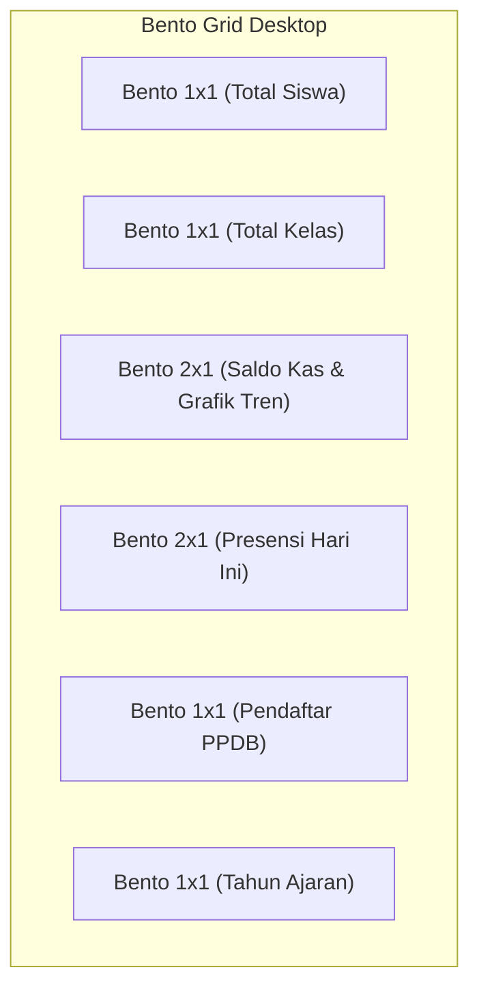

# Design System SMP Annida

Dokumentasi resmi arsitektur antarmuka pengguna (*UI/UX Design System*) untuk aplikasi manajemen sekolah **SMP Annida (SMPAnnida)**. Dokumen ini menetapkan standar desain terpadu berbasis **Single Light Mode Architecture (Unified Warm Light Theme)** yang menggabungkan estetika Islami, modernitas, nuansa alam (*Islamic, Modern, Nature*), dan kepatuhan standar aksesibilitas web internasional **WCAG AA & AAA**.

---

## Daftar Isi
1. [Filosofi & Prinsip Desain](#1-filosofi--prinsip-desain)
2. [Palet Warna (Color Palette)](#2-palet-warna-color-palette)
3. [Tipografi (Typography)](#3-tipografi-typography)
4. [Sistem Spasi & Grid (Spacing & Grid System)](#4-sistem-spasi--grid-spacing--grid-system)
5. [Komponen Antarmuka Pengguna (UI Components)](#5-komponen-antarmuka-pengguna-ui-components)
6. [Manajemen Z-Index (Z-Index Hierarchy)](#6-manajemen-z-index-z-index-hierarchy)
7. [Desain Responsif & Breakpoint (Responsive Design)](#7-desain-responsif--breakpoint-responsive-design)
8. [Ikonografi & Aset Visual (Icons & Visual Assets)](#8-ikonografi--aset-visual-icons--visual-assets)
9. [Pola Layout & Shell Aplikasi (Layout Patterns)](#9-pola-layout--shell-aplikasi-layout-patterns)
10. [Animasi & Transisi (Animations & Transitions)](#10-animasi--transisi-animations--transitions)
11. [Panduan Aksesibilitas (Accessibility & WCAG Guide)](#11-panduan-aksesibilitas-accessibility--wcag-guide)

---

## 1. Filosofi & Prinsip Desain

SMP Annida menerapkan bahasa visual terpadu yang dirancang untuk kecepatan navigasi staf sekolah, kemudahan bagi calon wali murid, dan keterbacaan data yang tinggi.

* **Single Light Mode Architecture**: Berdasarkan spesifikasi desain proyek, seluruh sistem dikunci secara konsisten pada mode terang (*Warm Light Theme*) melalui `data-theme="light"` dan `class="light"`. Tombol *dark mode toggle* telah dinonaktifkan secara permanen untuk menjamin konsistensi cetak rapor, keterbacaan tabel keuangan, dan visual branding sekolah.
* **Karakter Visual Islami & Natural**: Memadukan warna hijau daun tua (*Forest Emerald* `#166534`), aksen hijau herbal `#15803d`, latar belakang kanvas hangat `#f8fafc`, tekstur geometri Islami halus (*subtle Islamic pattern*), serta siluet botani Annida.
* **High Contrast & Content-First**: Menghindari kartu semi-transparan yang buram untuk membaca data angka/tabel; seluruh permukaan kartu menggunakan warna putih solid `#ffffff` dengan garis pembatas Slate `#e2e8f0` sehingga rasio kontras mencapai standar WCAG AAA (hingga 15.8:1).
* **Robust Mobile First Split-Rail**: Sistem navigasi dua lapis (Rail Bar 52px + Submenu Panel 200px) yang dapat diciutkan di desktop dan berubah menjadi drawer mengambang otomatis di perangkat seluler tanpa merusak tata letak konten utama.

---

## 2. Palet Warna (Color Palette)

Nilai warna di bawah ini diekstrak langsung dari `:root` pada berkas `css/theme/layout.css`, `css/theme.css`, dan `css/style.css`.

### 2.1 Warna Merek & Aksen (Brand Colors)
| Token CSS | Kode Hex | Sampel Visual | Deskripsi & Rasio Kontras |
| :--- | :--- | :---: | :--- |
| `--primary` | `#15803d` | `■` `#15803d` | **Green 700**: Warna aksi utama, tombol utama, tautan aktif. Rasio kontras 4.8:1 pada `#ffffff` (WCAG AA). |
| `--primary-hover` | `#166534` | `■` `#166534` | **Green 800**: State hover tombol utama dan latar submenu panel sidebar. |
| `--primary-light` | `#f0fdf4` | `■` `#f0fdf4` | **Green 50**: Latar belakang fokus item, highlight baris, tint lembut. |
| `--primary-focus` | `rgba(22, 163, 74, 0.25)` | `■` Transparan | Shadow ring fokus formulir & kontrol sentuh. |
| `--accent` | `#15803d` | `■` `#15803d` | Warna aksen penanda visual aktif. |
| `--accent-emerald` | `#10b981` | `■` `#10b981` | Indikator rail aktif, pulse status online database. |
| `--accent-mint` | `#34d399` | `■` `#34d399` | Border indikator tab dan teks aktif pada bilah gelap sidebar. |

### 2.2 Warna Kanvas & Permukaan Kartu (Canvas & Surfaces)
| Token CSS | Kode Hex / Nilai | Deskripsi Penggunaan |
| :--- | :--- | :--- |
| `--bg-canvas-color` | `#f8fafc` | **Slate 50**: Latar belakang utama seluruh halaman (`html`, `body`). |
| `--glass-bg` | `#ffffff` | **Solid White**: Permukaan kartu, panel bento, modal dialog, formulir. |
| `--glass-bg-hover` | `#f8fafc` | State hover kartu atau tabel baris. |
| `--glass-border` | `#e2e8f0` | **Slate 200**: Garis batas struktural kartu, pemisah tabel, dan input. |
| `--glass-border-subtle` | `#f1f5f9` | **Slate 100**: Garis batas pembagi sel tabel atau separator sekunder. |
| `--glass-shadow` | `0 1px 3px 0 rgba(0, 0, 0, 0.06), 0 1px 2px 0 rgba(0, 0, 0, 0.04)` | Bayangan elevasi standar kartu ringan (*Card Elevation 1*). |
| `--glass-shadow-lg` | `0 10px 15px -3px rgba(0, 0, 0, 0.08), 0 4px 6px -2px rgba(0, 0, 0, 0.04)` | Bayangan elevasi menu melayang atau dropdown (*Elevation 2*). |

### 2.3 Tipografi & Netral Keterbacaan Tinggi (Neutrals)
| Token CSS | Kode Hex | Rasio Kontras | Kegunaan Utama |
| :--- | :--- | :---: | :--- |
| `--text-primary` | `#0f172a` | **15.8:1** (WCAG AAA) | Slate 900. Judul halaman, teks isi utama, angka nilai siswa. |
| `--text-secondary` | `#334155` | **9.5:1** (WCAG AAA) | Slate 700. Label formulir, deskripsi kartu, subjudul. |
| `--text-muted` | `#475569` | **7.0:1** (WCAG AAA) | Slate 600. Header tabel data, keterangan waktu, breadcrumb. |
| `--text-subtle` | `#64748b` | **4.6:1** (WCAG AA) | Slate 500. Placeholder input, teks bantuan pembantu (*helper*). |
| `--text-inverse` | `#ffffff` | **15.8:1** | Teks putih murni untuk tombol utama dan bilah sidebar hijau tua. |

### 2.4 Navigasi Bilah Sisi & Atas (Sidebar & Topbar)
| Token / Elemen | Kode Hex | Deskripsi Penggunaan |
| :--- | :--- | :--- |
| `--sidebar-bg` | `#166534` | **Green 800**: Latar belakang panel bilah menu samping. |
| `.split-rail-bar` | `#14532d` | **Green 900**: Bilah ikon 52px kolom kiri navigasi Split-Rail. |
| `.split-rail-panel` | `#166534` | **Green 800**: Bilah submenu 200px navigasi Split-Rail. |
| `--sidebar-border` | `#15803d` | Garis pembatas vertikal antara rail bar, submenu panel, dan konten. |
| `--sidebar-text` | `#f0fdf4` | Warna teks item navigasi dalam sidebar. |
| `--sidebar-text-active`| `#ffffff` | Teks item yang sedang aktif (dengan border kiri `#34d399`). |
| `--topbar-bg` | `#ffffff` | Latar topbar putih dengan opasitas `0.96` dan `backdrop-filter: blur(12px)`. |
| `--topbar-border` | `#e2e8f0` | Garis pembatas bawah topbar. |
| `.student-bottom-nav` | `#166534` | Latar navigasi bawah khusus portal siswa di smartphone (tinggi 64px). |

### 2.5 Lencana Status & Kategori (Semantic Status Badges)
| Kategori Status | Latar Belakang (`bg`) | Teks (`text`) | Garis Tepi (`border`) | Contoh Kasus |
| :--- | :--- | :--- | :--- | :--- |
| **Success** | `#dcfce7` (Green 100) | `#166534` (Green 800) | `#86efac` (Green 300) | Hadir, Lunas, Diterima, Terverifikasi |
| **Warning** | `#fef3c7` (Amber 100) | `#92400e` (Amber 800) | `#fde68a` (Amber 300) | Izin, Sakit, Pending, Menunggu Verifikasi |
| **Danger** | `#fee2e2` (Red 100) | `#991b1b` (Red 800) | `#fca5a5` (Red 300) | Alpa, Ditolak, Belum Lunas, Dibatalkan |
| **Info** | `#e0f2fe` (Sky 100) | `#075985` (Sky 800) | `#bae6fd` (Sky 300) | Diproses, Draft, Catatan Baru |

### 2.6 Modul Keuangan (Finance Specific)
| Tipe Transaksi | Teks & Ikon | Latar Belakang Transparan |
| :--- | :--- | :--- |
| **Pemasukan (Income)** | `#15803d` | `rgba(21, 128, 61, 0.10)` |
| **Pengeluaran (Expense)** | `#b91c1c` | `rgba(185, 28, 28, 0.10)` |

---

## 3. Tipografi (Typography)

Sistem tipografi SMP Annida membedakan antara kebutuhan visual *branding* seremonial dan kebutuhan efisiensi data padat (*tabular data*).

### 3.1 Keluarga Huruf (Font Families)
* **Antarmuka Utama & Data Sistem (Default UI)**:
  ```css
  font-family: 'Inter', -apple-system, BlinkMacSystemFont, 'Segoe UI', Roboto, sans-serif;
  ```
  Digunakan pada seluruh dasbor akademik, keuangan, dan tabel data administratif karena keterbacaan angka dan simbol metrik yang sangat stabil.
* **Landing Page & Portal Masuk (Public & PPDB)**:
  ```css
  font-family: 'Nunito Sans', -apple-system, BlinkMacSystemFont, 'Segoe UI', Roboto, sans-serif;
  ```
  Memberikan kesan ramah, bersahabat, dan jelas bagi calon wali murid dan siswa baru.
* **Display Brand & Judul Islami (Serif Display)**:
  ```css
  font-family: 'Literata', serif; /* Class utilitas: .font-serif-annida */
  ```
  Digunakan secara selektif pada header sambutan resmi madrasah, kartu pendaftaran seremonial PPDB, dan piagam kelulusan.
* **Data Monospace (Kode & Nomor Registrasi)**:
  ```css
  font-family: ui-monospace, SFMono-Regular, Menlo, Monaco, Consolas, monospace;
  ```
  Digunakan untuk Nomor Registrasi Calon Siswa (misal `PPDB-2027-00124`), kunci konfigurasi, dan format mata uang teknis.

### 3.2 Skala Ukuran Font & Hirarki
| Token CSS | Ukuran Rem | Piksel | Weight Standar | Penerapan |
| :--- | :--- | :--- | :---: | :--- |
| `--font-size-xs` | `0.75rem` | 12px | 600 / 700 | Status badge, timestamp, metadata footer, data-label mobile |
| `--font-size-sm` | `0.875rem`| 14px | 500 / 600 | Item submenu sidebar, teks tombol mini, judul metrik |
| `--font-size-md` | `1.00rem` | 16px | 400 / 500 | Teks isi (*body*), sel tabel data, input formulir |
| `--font-size-lg` | `1.125rem`| 18px | 600 | Judul kartu, judul modal dialog, judul topbar |
| `--font-size-xl` | `1.25rem` | 20px | 700 | Subjudul halaman, judul kategori besar |
| `--font-size-2xl`| `1.50rem` | 24px | 700 | Judul halaman (*page-title*), kartu selamat datang |
| `--font-size-3xl`| `1.875rem`| 30px | 800 | Nilai statistik dashboard (`.metric-value`) |
| `--font-size-4xl`| `2.25rem` | 36px | 800 | Headline utama beranda PPDB, spanduk pengumuman |
| `.bento-stat-num`| `2.00rem` | 32px | 800 | Angka statistik utama pada Bento Grid (`color: #15803d`) |

### 3.3 Bobot Huruf (Font Weights)
* `400` (**Regular**): Teks narasi panjang dan catatan penjelasan.
* `500` (**Medium**): Teks tautan navigasi, nilai isian input, label umum.
* `600` (**Semi-Bold**): Header kolom tabel, subjudul kartu, label badge status.
* `700` (**Bold**): Judul kartu, nama tombol aksi utama, nama mapel jadwal.
* `800` (**Extra-Bold**): Angka statistik, ringkasan saldo keuangan, nominal SPP.

---

## 4. Sistem Spasi & Grid (Spacing & Grid System)

### 4.1 Skala Spasi (Spacing Scale)
```css
:root {
  --space-xs: 0.25rem;  /* 4px  - Jarak antar ikon & teks mini */
  --space-sm: 0.5rem;   /* 8px  - Jarak elemen tombol atau badge */
  --space-md: 1rem;     /* 16px - Padding standar input & mobile card */
  --space-lg: 1.5rem;   /* 24px - Jarak grid bento & padding desktop card */
  --space-xl: 2rem;     /* 32px - Margin antar seksi & padding halaman */
  --space-2xl: 3rem;    /* 48px - Margin hero banner */
}
```

### 4.2 Sudut Lengkung (Border Radius Scale)
* `--radius-sm` (`6px`): Badge status, tag waktu mapel, checkbox, scrollbar thumb.
* `--radius-md` (`8px` - `10px`): Input form, dropdown select, tombol aksi, item navigasi sidebar.
* `--radius-lg` (`12px` - `14px`): Kartu metrik standar, bento card, kartu jadwal mapel.
* `--radius-xl` (`16px` - `20px`): Dialog modal, panel pembungkus tabel (*table container*).
* `--radius-full` (`9999px`): Avatar pengguna, pill badge, pill toggle indicator.

### 4.3 Arsitektur Bento Grid (Bento Grid Architecture)
Sistem dasbor SMP Annida menggunakan tata letak bento 4 kolom adaptif yang mengelompokkan metrik ke dalam proporsi rasional:



* **Deklarasi CSS**:
  ```css
  .bento-grid {
    display: grid !important;
    grid-template-columns: repeat(4, 1fr) !important;
    gap: 1.25rem !important;
    margin-bottom: 2rem !important;
  }
  .bento-card {
    background: #ffffff !important;
    border: 1px solid #e2e8f0 !important;
    border-radius: 14px !important;
    padding: 1.25rem 1.4rem !important;
    display: flex !important;
    flex-direction: column !important;
    justify-content: space-between !important;
    transition: transform 0.2s ease, border-color 0.2s ease, box-shadow 0.2s ease !important;
  }
  .bento-card:hover {
    border-color: #86efac !important;
    box-shadow: 0 4px 12px rgba(0, 0, 0, 0.08) !important;
    transform: translateY(-2px) !important;
  }
  .bento-1x1 { grid-column: span 1 !important; }
  .bento-2x1 { grid-column: span 2 !important; }
  ```
* **Responsivitas Bento**:
  * **Desktop (> 1024px)**: 4 kolom (`repeat(4, 1fr)`).
  * **Tablet (<= 1024px)**: 2 kolom (`repeat(2, 1fr)`). Item `.bento-2x1` mengisi span 2.
  * **Smartphone (<= 768px)**: 1 kolom vertikal (`1fr`). Seluruh item `.bento-1x1` dan `.bento-2x1` meluas penuh (span 1).

---

## 5. Komponen Antarmuka Pengguna (UI Components)

### 5.1 Split-Rail Sidebar Navigation
Navigasi bilah sisi terintegrasi dua lapis yang disuntikkan secara dinamis melalui `js/core/layout.js`.

```
┌────────┬─────────────────────────────┐
│ 52px   │ 200px Submenu Panel         │
│ Rail   ├─────────────────────────────┤
│ Bar    │ Kategori: Akademik      [X] │
│        ├─────────────────────────────┤
│ [Logo] │ [Search Menu...     Ctrl+K] │
│        ├─────────────────────────────┤
│ [Grid] │  • Dashboard Utama          │
│ [*Sch] │  • Data Siswa               │
│ [Pay]  │  • Data Guru & Kelas        │
│ [PPDB] │  • Jadwal & Presensi        │
│ [Gear] │  • Rapor & Nilai            │
│        ├─────────────────────────────┤
│ [Dock] │ [Avatar] Admin Annida       │
│ [Exit] │          admin@smpannida... │
└────────┴─────────────────────────────┘
```

1. **Lapisan 1 (Rail Bar - Lebar 52px)**:
   * Posisi: Kiri absolut/menetap.
   * Latar: `#14532d` (Green 900), batas kanan `1px solid #15803d`.
   * Berisi logo sekolah 36x36px di bagian atas, tombol ikon modul utama (Super Dashboard, Akademik, Keuangan, PPDB, Pengaturan Sistem), serta tombol ciutkan (`#sidebar-panel-toggle`) dan keluar di bawah.
   * Status aktif (`.rail-btn.active`): Memunculkan garis vertikal penanda hijau cerah `#10b981` dengan efek glow di sisi kiri tombol.
2. **Lapisan 2 (Context Submenu Panel - Lebar 200px)**:
   * Posisi: Menempel di samping Rail Bar. Total lebar gabungan: **252px**.
   * Latar: `#166534` (Green 800), batas kanan `1px solid #15803d`.
   * Memuat judul kategori aktif, tombol tutup panel, kotak pencarian menu instan (`Ctrl+K`), tautan sub-halaman yang sedang dibuka, serta kartu profil pengguna di bagian kaki (*footer*).
   * **State Ciut (Collapsed State)**: Saat tombol ciut diklik, container memperoleh class `.panel-collapsed`. Lebar sidebar menyusut menjadi tepat **52px**, panel submenu bergeser `translateX(-15px)` dengan `opacity: 0`, dan area konten utama melebar penuh secara otomatis. Status disimpan di `localStorage ('smpannida-panel-collapsed')`.

### 5.2 Kartu Permukaan & Metrik (Cards & Surfaces)
* **Spesifikasi Standar**:
  ```css
  .card, .bento-card, .metric-card, .glass-panel {
    background: #ffffff !important;
    border: 1px solid #e2e8f0 !important;
    box-shadow: 0 1px 3px 0 rgba(0, 0, 0, 0.06), 0 1px 2px 0 rgba(0, 0, 0, 0.04) !important;
    border-radius: 12px;
    color: #0f172a;
  }
  ```
* **Kartu Jadwal Pelajaran (`.schedule-card`)**:
  * Menampilkan nama mata pelajaran dengan warna Slate 900 tebal `#0f172a`.
  * Memuat lencana waktu `.time-badge` berwarna hijau muda: `background: #dcfce7; color: #15803d; border: 1px solid #86efac; border-radius: 6px;`.
* **Kartu Anggaran Bulanan (`.budget-summary`)**:
  * Menampilkan nilai realisasi pengeluaran berwarna hijau `#15803d` (`font-weight: 800`) dan total pagu anggaran berwarna Slate 500 `#64748b`.

### 5.3 Tabel Data Responsif (Data Table to Card View)
SMP Annida menerapkan sistem transformasi tabel revolusioner: **tidak ada scrolling horizontal yang merusak layout di layar ponsel**.

* **Tampilan Desktop (> 768px)**:
  * Header tabel (`th`): Latar belakang `#f1f5f9`, teks Slate 600 `#475569`, huruf kapital (`uppercase`), ukuran 12px, border bawah `2px solid #e2e8f0`, padding `13px 16px`.
  * Baris data (`td`): Teks Slate 900 `#0f172a`, font 13.5px, padding `13px 16px`, border bawah `1px solid #e2e8f0`.
  * Baris hover: `background-color: #f8fafc`.
* **Transformasi Mobile (<= 768px)**:
  * `thead` disembunyikan (`display: none !important`).
  * Setiap baris `tr` diubah menjadi kartu vertikal terpisah (`display: block; background: #ffffff; border: 1px solid #e2e8f0; border-radius: 12px; padding: 12px 14px; margin-bottom: 12px; box-shadow: 0 1px 3px rgba(0,0,0,0.05);`).
  * Setiap sel `td` diubah menjadi flex row dengan perataan seimbang (`justify-content: space-between`).
  * Kolom kiri sel menampilkan nama header melalui pseudo-elemen `td[data-label]::before` yang diambil dari atribut `data-label`.
  * Fungsi Javascript `enhanceTablesForMobile()` yang dipicu otomatis oleh `MutationObserver` bertugas memetakan teks dari `thead th` ke atribut `data-label` setiap sel `td` secara dinamis.

```
┌──────────────────────────────────────────────┐
│ KARTU SISWA (BARIS TABEL DI LAYAR HP)        │
├──────────────────────────────────────────────┤
│ NAMA SISWA       : Ahmad Zaky Muzakki        │
│ KELAS            : 8-A (Tahfidz)             │
│ STATUS SPP       : [ LUNAS ]                 │
│ NILAI RATA-RATA  : 88.50                     │
│ AKSI             : [ DETAIL ]  [ CETAK ]     │
└──────────────────────────────────────────────┘
```

### 5.4 Formulir & Kontrol Masukan (Forms & Inputs)
* **Elemen Input (`input`, `select`, `textarea`, `.form-input`)**:
  * Latar: `#ffffff !important`
  * Garis tepi: `1px solid #cbd5e1 !important` (Slate 300)
  * Radius: `8px`
  * Padding: `0.65rem 0.95rem` (Tinggi minimum di mobile: `44px` untuk kenyamanan sentuhan jari)
  * Teks isian: `#0f172a` (Slate 900)
  * Placeholder: `#64748b` (Slate 500)
* **Fokus State (`:focus`)**:
  * `border-color: #15803d !important;`
  * `box-shadow: 0 0 0 3px rgba(21, 128, 61, 0.18) !important;`
  * `outline: none;`
* **Label Formulir (`label`, `.form-label`)**:
  * Warna: `#334155` (Slate 700), `font-weight: 500`, `font-size: 0.9rem`.

### 5.5 Tombol Aksi (Buttons)
* **Tombol Utama (`.btn-primary`, `button[type="submit"]`)**:
  * Latar: `#15803d`
  * Teks: `#ffffff` murni (`font-weight: 500` atau `600`)
  * Radius: `8px`
  * Bayangan: `0 4px 15px rgba(21, 128, 61, 0.25)`
  * State Hover: Latar `#166534`, bayangan `0 6px 20px rgba(21, 128, 61, 0.40)`, efek transisi `transform: translateY(-2px)`.
* **Tombol Garis Tepi (`.btn-outline`)**:
  * Latar: Transparan
  * Border: `1px solid #15803d`
  * Teks: `#15803d`
  * State Hover: Latar `#f0fdf4` (`--primary-light`), teks `#15803d`.
* **Tombol Hamburger Mobile (`.mobile-menu-btn`)**:
  * Terletak di kiri Topbar, disembunyikan di desktop, muncul di layar `<= 1024px`.
  * Ukuran target sentuh: `min-height: 44px; min-width: 44px; display: inline-flex; align-items: center; justify-content: center;`.
  * Memiliki `aria-label="Buka menu"`.

### 5.6 Kotak Dialog Modal (Modals)
* **Backdrop Modal (`.modal`, `.modal-backdrop`)**:
  * Posisi: `fixed; inset: 0;`
  * Latar: `rgba(0, 0, 0, 0.75)` dengan `backdrop-filter: blur(8px)`
  * Z-Index: `99999` (atau `--z-modal: 9999`)
* **Kotak Konten (`.modal-content`, `.modal-card`)**:
  * Latar: `#ffffff !important`
  * Border: `1px solid #e2e8f0`
  * Radius: `1.25rem` (20px)
  * Bayangan: `0 20px 25px -5px rgba(0, 0, 0, 0.1), 0 10px 10px -5px rgba(0, 0, 0, 0.04)`
  * Ukuran adaptif: `max-width: 95vw; max-height: 88vh; overflow-y: auto; padding: 1.25rem;`.

### 5.7 Notifikasi Toast Mengambang (Toasts)
Dikelola oleh fungsi `showToast(message, type)` pada `js/core/utils.js`:
* Terinjeksi otomatis ke kontainer tetap `#toast-container` di pojok kanan atas (`top: 20px; right: 20px; z-index: 999999;`).
* Gaya kaca buram premium (*frosted glass*): `backdrop-filter: blur(16px); border-radius: 12px; padding: 14px 24px; color: #ffffff; box-shadow: 0 8px 32px rgba(0, 0, 0, 0.25);`.
* **Varian Berdasarkan Tipe**:
  * `success`: Latar `rgba(34, 197, 94, 0.85)`, border `rgba(34, 197, 94, 0.5)`, ikon `✅`.
  * `error`: Latar `rgba(239, 68, 68, 0.85)`, border `rgba(239, 68, 68, 0.5)`, ikon `❌`.
  * `warning`: Latar `rgba(245, 158, 11, 0.85)`, border `rgba(245, 158, 11, 0.5)`, ikon `⚠️`.
  * `info`: Latar `rgba(59, 130, 246, 0.85)`, border `rgba(59, 130, 246, 0.5)`, ikon `ℹ️`.
* Durasi tayang: 3.5 detik, menghilang mulus dengan animasi pergeseran `translateY(-20px)` dan opasitas 0.

---

## 6. Manajemen Z-Index (Z-Index Hierarchy)

Untuk mencegah bug klasik *"backdrop overlay nyangkut"* atau *"menu drawer tidak bisa diklik"*, SMP Annida menetapkan **skala tunggal Z-Index** yang terpusat di `css/theme/layout.css` dan `css/theme.css`.

> [!IMPORTANT]
> **Aturan Baku Pengembang:** Dilarang keras menulis angka z-index sembarangan di berkas CSS komponen atau kode inline HTML. Selalu rujuk variabel token resmi di bawah ini.

```css
:root {
  --z-content: 1;             /* Lapisan kartu konten utama, grafik, dan tabel */
  --z-topbar: 1000;           /* Bilah navigasi atas (Sticky Topbar) */
  --z-drawer-backdrop: 1150;  /* Latar belakang gelap penutup layar saat drawer mobile terbuka */
  --z-drawer: 1200;           /* Bilah menu samping (Sidebar Drawer Mobile) */
  --z-sidebar: 1200;          /* Alias kompatibilitas bilah sisi desktop & mobile */
  --z-modal: 9999;            /* Jendela dialog formulir modal & alert konfirmasi */
  --z-overlay: 9999;          /* Alias lapisan penutup dialog sistem */
  --z-toast: 10000;           /* Notifikasi pemberitahuan toast mengambang */
}
```

### Solusi Arsitektur Konteks Stacking Backdrop:
* Back-end DOM drawer Backdrop (`.sidebar-overlay`) secara otomatis disisipkan oleh `getDrawerOverlay()` pada modul `js/core/layout.js` sebagai **saudara kandung (*sibling*) dari elemen `.sidebar`**, bukan langsung di bawah `<body>`.
* Hal ini mencegah jebakan susunan (*stacking context trap*) di mana kontainer `.app-container { z-index: 1 }` menempatkan backdrop di atas drawer sehingga tombol menu tidak dapat ditekan di smartphone.
* Selisih nilai `--z-drawer-backdrop (1150)` dan `--z-drawer (1200)` memastikan drawer navigasi selalu berada di atas bayangan gelap backdrop.

---

## 7. Desain Responsif & Breakpoint (Responsive Design)

SMP Annida menggunakan sistem *breakpoint* terstandarisasi yang memastikan seluruh modul dapat diakses sempurna melalui ponsel staf, tablet pengawas, hingga monitor dasbor proyektor kelas.

| Breakpoint | Lebar Layar | Status Perangkat | Perilaku Antarmuka Kunci |
| :--- | :--- | :--- | :--- |
| **Desktop Lebar** | `> 1280px` | Monitor / PC Guru | Sidebar Split-Rail penuh (252px), Bento Grid 4 kolom, Main Grid 1.8fr : 1.2fr. |
| **Tablet Landscape**| `1025px - 1280px`| Laptop Kecil / iPad Pro | Sidebar adaptif (220px - 252px), Bento Grid 2 kolom, tabel data penuh. |
| **Drawer Breakpoint**| `<= 1024px` | iPad Vertikal / Tablet | **Drawer Mode Aktif**. Sidebar tersembunyi ke kiri (`translateX(-100%)`). Tombol hamburger muncul di Topbar. |
| **Smartphone Standar**| `<= 768px` | Ponsel Pintar (iPhone/Android) | **Card View Tabel Aktif**. Bento Grid 1 kolom vertikal. Padding bawah aman 5rem (`padding-bottom: 5rem`). |
| **Small Smartphone**| `<= 640px` | Layar Kompak (< 400px) | Seluruh tab menu membungkus vertikal (*flex-wrap*), filter bar form 100% lebar penuh. |

### Detail Perilaku Khusus Perangkat Seluler (`<= 1024px`)
1. **Pengendali Tunggal Drawer (`setSidebar(open)`)**:
   * State drawer dikendalikan murni melalui pergantian class CSS: `.open`, `.active`, `.show` pada `.sidebar`, serta `.show` pada `.sidebar-overlay`. Tidak menggunakan inline style yang rentan konflik cache.
   * `body` memperoleh class `.sidebar-open` dengan `overflow: hidden` untuk mengunci gulir layar belakang (*scroll lock*).
2. **Penutupan Otomatis (Lifecycle Auto-Close)**:
   * **Navigasi Klik**: Mengetuk tautan menu apapun di dalam drawer otomatis menutup bilah menu.
   * **Tombol Escape**: Menekan tombol keyboard `Esc` langsung menutup drawer.
   * **Rotasi Layar & Resize**: Event `resize` dan `orientationchange` menutup drawer jika layar melampaui `1024px`.
   * **Pergantian Tab Aplikasi**: Event `visibilitychange` menutup drawer saat pengguna beralih aplikasi atau mengunci ponsel.
3. **Target Sentuh Ramah Jari (Touch-Target Accessibility)**:
   * Seluruh tombol utama, input pilihan, dan pemicu tab memiliki tinggi minimum `44px` dengan `touch-action: manipulation;` untuk meniadakan keterlambatan respon sentuh 300ms.
4. **Navigasi Bawah Khusus Siswa (`.student-bottom-nav`)**:
   * Pada portal siswa, bilah navigasi bawah tetap terpasang setinggi `64px` dengan 4 menu cepat (Beranda, Jadwal, Nilai, Profil) dan penanda aktif hijau mint `#4ade80`.

---

## 8. Ikonografi & Aset Visual (Icons & Visual Assets)

### 8.1 Ikon Google Material Symbols Outlined
Seluruh modul menggunakan koleksi ikon modern resmi dari Google:
```html
<link rel="stylesheet" href="https://fonts.googleapis.com/css2?family=Material+Symbols+Outlined:opsz,wght,FILL,GRAD@24,400,0,0&display=swap" />
```
* **Ukuran Standar**:
  * `16px` (`text-base`): Ikon pencarian form, indikator panah submenu.
  * `20px` - `24px` (`text-lg`): Tombol ikon pada Rail Bar 52px, tombol aksi tabel.
  * `28px` - `32px` (`text-2xl`): Tombol menu hamburger topbar, ikon konfirmasi modal.
* **Daftar Ikon Inti yang Digunakan**:
  * `grid_view` : Super Dashboard
  * `school` : Akademik & Kesiswaan
  * `payments` / `account_balance_wallet` : Keuangan & Kas
  * `person_add` / `group` : PPDB & Data Siswa
  * `settings` : Sistem & Pengaturan
  * `calendar_month` : Jadwal Pelajaran
  * `assignment` / `fact_check` : Nilai & Presensi Siswa
  * `menu_book` : Mata Pelajaran & Jurnal Guru
  * `dock_to_left` : Toggle Buka/Tutup Submenu Panel
  * `logout` : Keluar dari Sistem

### 8.2 Logo & Identitas Madrasah
* **Logo Resmi**: Berkas `assets/logo/1.webp` (Rasio 1:1, format webp terkompresi tajam).
* **Fallback Gambar**: `/logo_1x1.png` dipicu otomatis via event `onerror="this.src='/logo_1x1.png';"`.
* **Favicon**: Tersemat dengan `<link rel="icon" href="/assets/logo/1.webp" type="image/webp">`.

### 8.3 Tekstur Latar Belakang & Watermark Alam (Botanical Texture)
* **Tekstur Geometri Islami Halus (`body::before`)**:
  * Terpasang pada lapisan tetap berukuran `120px 120px` dengan opasitas `0.45` di atas latar kanvas Slate 50 `#f8fafc`.
  * Membentuk pola bintang heksagonal dan daun simetris dengan warna `#bbf7d0` (Green 200) dan goresan lembut `#86efac` tanpa mengganggu keterbacaan teks.
* **Watermark Daun Botani Sidebar (`.sidebar::after`)**:
  * Tersemat di pojok kanan bawah bilah menu hijau tua dengan dimensi `140px 140px` dan opasitas `0.20`.
  * Menegaskan identitas Annida sebagai Sekolah Alam yang asri dan sejuk.

---

## 9. Pola Layout & Shell Aplikasi (Layout Patterns)

Aplikasi dibangun dengan arsitektur cangkang (*Application Shell Pattern*) yang konsisten di semua halaman dasbor (`dashboard.html`, `pages/academic/dashboard.html`, `pages/finance/dashboard.html`, `pages/ppdb/dashboard-admin.html`).

### 9.1 Struktur DOM Shell Standar
```html
<!DOCTYPE html>
<html lang="id" class="light" data-theme="light">
<head>
  <!-- Meta, CSS Tokens, & Fonts -->
  <link rel="stylesheet" href="../../css/style.css">
  <link rel="stylesheet" href="../../css/mobile.css">
  <link rel="stylesheet" href="../../css/theme.css">
</head>
<body>
  <!-- Container Flex Utama -->
  <div class="app-container">
    
    <!-- Bilah Navigasi Terpadu (Diinjeksi via layout.js) -->
    <aside class="sidebar split-rail-container" id="sidebar"></aside>

    <!-- Konten Utama Halaman -->
    <main class="main-content">
      <!-- Topbar Header Lengket (Sticky Topbar) -->
      <header class="topbar" id="topbar"></header>

      <!-- Area Isi Halaman Spesifik -->
      <div class="content-area">
        <!-- Judul Halaman -->
        <div class="page-header">
          <div>
            <h1 class="page-title">Judul Halaman</h1>
            <p class="page-subtitle">Deskripsi ringkas aktivitas atau laporan.</p>
          </div>
        </div>

        <!-- Bento Grid / Metrik -->
        <div class="bento-grid">...</div>

        <!-- Tabel Data / Panel Konten -->
        <div class="card p-6">...</div>
      </div>
    </main>

  </div>

  <!-- Script Core Layout -->
  <script type="module">
    import { injectSidebar, injectTopbar } from '../../js/core/layout.js';
    injectSidebar('sidebar');
    injectTopbar('topbar', {
      greeting: 'Assalamu’alaikum,',
      title: 'Dasbor Guru & Staf',
      rightHtml: '<div class="user-badge">...</div>'
    });
  </script>
</body>
</html>
```

---

## 10. Animasi & Transisi (Animations & Transitions)

Seluruh pergerakan visual dirancang sehalus mungkin (*smooth & non-intrusive*) dengan akselerasi kurva *cubic-bezier*.

### 10.1 Skala Durasi Transisi
* `--transition-fast` (`0.15s ease`): Respon kursor saat hover tombol, perubahan warna teks link, ikon tutup.
* `--transition-normal` (`0.25s cubic-bezier(0.4, 0, 0.2, 1)`): Pergeseran panel submenu Split-Rail, hover kartu bento, pembukaan dropdown filter.
* `--transition-slow` (`0.40s ease`): Kemunculan backdrop drawer mobile, animasi buka dialog modal.

### 10.2 Transisi Antar Halaman Mulus (Smooth Page Fade)
Untuk menghilangkan kedipan putih saat berpindah halaman:
```css
body {
  animation: pageFadeIn 0.3s ease-out forwards;
}
@keyframes pageFadeIn {
  from { opacity: 0; transform: translateY(4px); }
  to   { opacity: 1; transform: translateY(0); }
}
.page-fade-out {
  opacity: 0;
  transition: opacity 0.25s ease-out;
}
```
* **Fungsi `smoothRedirect(url)`**: Dipanggil saat link navigasi diklik; menambahkan kelas `.page-fade-out` selama 250ms sebelum `window.location.href` dieksekusi.
* **Penanganan BFCache (`pageshow`)**: Menghilangkan class `.page-fade-out` jika halaman dipulihkan dari cache browser tombol kembali (*back button*).

### 10.3 Efek Pemuatan Kerangka (Skeleton Shimmer)
```css
.skeleton {
  background: linear-gradient(
    90deg,
    rgba(226, 232, 240, 0.4) 25%,
    rgba(241, 245, 249, 0.9) 37%,
    rgba(226, 232, 240, 0.4) 63%
  );
  background-size: 400% 100%;
  animation: skeleton-shimmer 1.4s ease infinite;
  border-radius: 6px;
}
@keyframes skeleton-shimmer {
  0%   { background-position: 100% 50%; }
  100% { background-position: 0% 50%; }
}
```

---

## 11. Panduan Aksesibilitas (Accessibility & WCAG Guide)

Sistem antarmuka SMP Annida dibangun dengan kepatuhan ketat pada standar **WCAG 2.1 Level AA & AAA**.

### 11.1 Rasio Kontras Warna yang Lolos Verifikasi
* **Teks Slate 900 (`#0f172a`) pada Kanvas Putih (`#ffffff`)**:
  * Rasio Kontras: **15.8:1** (Kategori AAA - Syarat minimum AAA adalah 7.0:1).
* **Teks Slate 700 (`#334155`) pada Kanvas Putih (`#ffffff`)**:
  * Rasio Kontras: **9.5:1** (Kategori AAA).
* **Teks Slate 600 (`#475569`) pada Kanvas Putih (`#ffffff`)**:
  * Rasio Kontras: **7.0:1** (Kategori AAA).
* **Warna Aksi Green 700 (`#15803d`) pada Putih (`#ffffff`)**:
  * Rasio Kontras: **4.8:1** (Kategori AA - Syarat minimum teks normal AA adalah 4.5:1).
* **Perbaikan Kontras Lampau (Legacy Fix)**:
  * Teks hijau cerah (`#10b981` / `#34d399`) yang sebelumnya hanya memiliki rasio 1.7:1 pada latar terang telah dilarang untuk elemen teks bacaan dan wajib digantikan oleh Green 700 `#15803d`.

### 11.2 Penanganan Fokus & Navigasi Papan Ketik (Keyboard Navigation)
* **Indikator Cincin Fokus (Focus Ring)**: Seluruh elemen interaktif (`button`, `a`, `input`, `select`) memiliki cincin fokus berkontras tinggi:
  ```css
  :focus-visible {
    outline: none;
    border-color: #15803d;
    box-shadow: 0 0 0 3px rgba(21, 128, 61, 0.25);
  }
  ```
* **Pintasan Keyboard Tersemat**:
  * `Ctrl + K` atau `Cmd + K`: Memfokuskan kursor ke input pencarian menu sidebar seketika.
  * `Escape`: Menutup drawer menu samping seluler atau jendela modal yang aktif.

### 11.3 Atribut ARIA & Semantik Aksesibilitas
* Setiap tombol berbasis ikon tanpa teks wajib memiliki atribut deskripsi `aria-label` (contoh: `<button aria-label="Buka menu navigasi" ...>`).
* Backdrop drawer mobile menyertakan `aria-hidden="true"` saat tertutup dan berubah menjadi `false` saat terbuka.
* Struktur halaman wajib mempertahankan hierarki judul yang benar (`h1` unik untuk nama modul, `h2` untuk bagian utama, `h3` untuk sub-kartu).

### 11.4 Sanitasi Data Mencegah XSS pada Komponen
Setiap modul yang merender data string dinamis ke dalam komponen kartu atau tabel melalui `innerHTML` wajib memanggil fungsi sanitasi dari `js/core/utils.js`:
* `escapeHTML(str)`: Menghilangkan potensi injeksi tag `<script>` atau HTML berbahaya.
* `escapeAttr(str)`: Mengamankan nilai di dalam atribut HTML seperti `value=""` atau `title=""`.

---
*Dokumen ini merupakan acuan resmi pengembangan tampilan antarmuka web SMP Annida. Pembaruan token atau komponen baru harus selaras dengan prinsip-prinsip yang telah ditetapkan di atas.*
