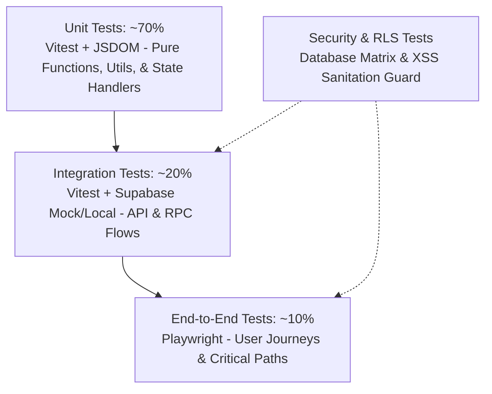
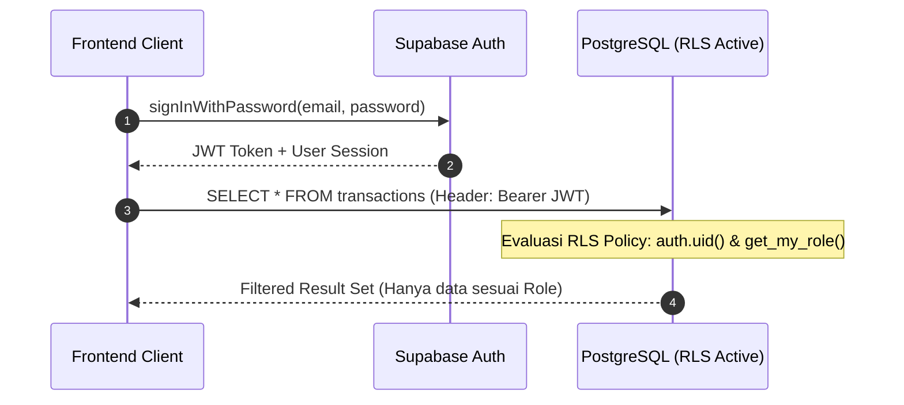
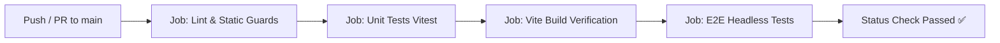

# Panduan Pengujian Sistem (Testing Guide)

*Dokumentasi komprehensif strategi pengujian, verifikasi keamanan, checklist QA, dan panduan automasi untuk sistem manajemen sekolah terpadu SMP Annida.*

---

## Daftar Isi
1. [Status Testing Saat Ini](#1-status-testing-saat-ini)
2. [Strategi Testing yang Direkomendasikan](#2-strategi-testing-yang-direkomendasikan)
3. [Unit Testing (Spesifikasi per Modul)](#3-unit-testing-spesifikasi-per-modul)
4. [Integration Testing (Supabase Query & Auth Flow)](#4-integration-testing-supabase-query--auth-flow)
5. [End-to-End (E2E) Testing](#5-end-to-end-e2e-testing)
6. [Security Testing (RLS, XSS, & Auth Bypass)](#6-security-testing-rls-xss--auth-bypass)
7. [Checklist Manual Testing per Modul](#7-checklist-manual-testing-per-modul)
8. [Test Data & Fixtures](#8-test-data--fixtures)
9. [Rencana Integrasi CI/CD](#9-rencana-integrasi-cicd)
10. [Panduan Menjalankan Test](#10-panduan-menjalankan-test)

---

## 1. Status Testing Saat Ini

Berdasarkan audit codebase SMP Annida per September 2026, infrastruktur pengujian telah mulai dibangun dengan beberapa alat dan script pagar regresi (*regression guards*).

### 1.1 Alat & Dependensi yang Sudah Terpasang
Dalam berkas [`package.json`](file:///C:/Users/ThinkPad/Projects/SMPAnnida/package.json), dependensi pengujian yang terdaftar pada `devDependencies`:
- **`vitest`** (`^5.0.2`): Test runner modern berbasis Vite dengan kecepatan eksekusi tinggi dan dukungan native ES modules.
- **`jsdom`** (`^30.1.1`): Lingkungan simulasi browser DOM untuk menjalankan pengujian komponen web tanpa browser fisik.
- Konfigurasi test runner didefinisikan pada [`vitest.config.js`](file:///C:/Users/ThinkPad/Projects/SMPAnnida/vitest.config.js):
  ```javascript
  import { defineConfig } from 'vitest/config';
  export default defineConfig({
    test: {
      environment: 'jsdom',
    },
  });
  ```

### 1.2 Skrip Pengujian yang Tersedia
Terdapat 3 perintah pengujian utama pada `package.json`:

```json
"scripts": {
  "test": "vitest run",
  "test:drawer": "node scripts/test-drawer-guards.js",
  "test:integrity": "node scripts/test-integrity.js"
}
```

1. **`npm test` (`vitest run`)**:
   - Menjalankan unit test berbasis Vitest.
   - Saat ini menguji satu file: [`js/core/layout.test.js`](file:///C:/Users/ThinkPad/Projects/SMPAnnida/js/core/layout.test.js) (2 skenario uji lolos / *passed*).
   - Memvalidasi fungsi `setSidebar(true)` dan `setSidebar(false)` untuk membuka/menutup drawer mobile, memanipulasi class `.open` dan `.show`, serta mengunci *scrolling* `document.body.style.overflow = 'hidden'`.

2. **`npm run test:drawer` ([`scripts/test-drawer-guards.js`](file:///C:/Users/ThinkPad/Projects/SMPAnnida/scripts/test-drawer-guards.js))**:
   - Skrip pagar regresi khusus untuk tata letak (*layout*) mobile drawer, skala *z-index*, Service Worker kill-switch, dan penangkal cache CSS (*cache-buster*).
   - Menginspeksi kode sumber secara statis untuk memastikan tidak ada konflik *stacking context* atau manipulasi *inline style* ilegal pada elemen drawer.

3. **`npm run test:integrity` ([`scripts/test-integrity.js`](file:///C:/Users/ThinkPad/Projects/SMPAnnida/scripts/test-integrity.js))**:
   - Menjaga kebijakan integritas sistem:
     - Memastikan seluruh residu mode guest (`isGuest`, `guest_mode_active`) telah dibersihkan dari kode produksi.
     - Memvalidasi keberadaan kill-switch Service Worker di [`public/sw.js`](file:///C:/Users/ThinkPad/Projects/SMPAnnida/public/sw.js).
     - Memvalidasi ketiadaan penetapan inline-style pada elemen sidebar.
     - Memvalidasi cache-buster parameter `?v=` pada pemanggilan CSS di halaman *dashboard*.
     - Menguji fungsi perhitungan kalkulator biaya PPDB (`calculateEstimate(program, childCount)`).

### 1.3 Analisis Celah Pengujian (*Testing Gaps*)
Meskipun pengujian tata letak dan regresi DOM statis sudah berjalan, terdapat celah pengujian pada logika aplikasi inti:
- **Belum ada Unit Test** untuk fungsi pembersih data (`escapeHTML`, `escapeAttr`, `formatCurrency`), *role resolver* (`resolveUserRole`), validasi formulir, kalkulasi penggajian guru (*syahriah*), dan perhitungan rekap nilai/rapor.
- **Belum ada Integration Test** untuk validasi komunikasi API Supabase, penanganan error jaringan, dan eksekusi RPC PostgreSQL.
- **Belum ada E2E Automated Test** (seperti Playwright) untuk memverifikasi alur lengkap login, pendaftaran PPDB, input nilai rapor, dan pencatatan transaksi kas.
- **Belum ada Security Policy Automated Test** untuk memverifikasi kebijakan Row Level Security (RLS) PostgreSQL antar *role*.
- **Belum ada CI/CD Pipeline** aktif di GitHub Actions untuk menjalankan pengujian secara otomatis pada setiap *Pull Request* atau *Push*.

---

## 2. Strategi Testing yang Direkomendasikan

Untuk mencapai stabilitas tinggi tanpa membebani performa pengembangan, diterapkan piramida pengujian terstruktur:



### 2.1 Alokasi Layer Pengujian
1. **Unit Testing (70%)**:
   - Eksekusi sangat cepat (< 5 detik).
   - Menguji *pure functions*, manipulasi string, formatting, perhitungan matematis, validasi skema input, dan penentuan role.
   - Dijalankan secara lokal pada setiap perubahan kode (*watch mode*).
2. **Integration Testing (20%)**:
   - Menguji interaksi modul dengan *database* Supabase (mocked client atau Supabase Local CLI).
   - Memastikan manipulasi filter query, pagination, dan handling error database berfungsi sesuai ekspektasi.
3. **End-to-End (E2E) Testing (10%)**:
   - Menguji alur pengguna nyata (*user journeys*) melalui browser headless (Playwright).
   - Fokus pada alur paling krusial: Autentikasi & redirection RBAC, pendaftaran PPDB mandiri, konversi santri baru, transaksi keuangan, dan penerbitan rapor.
4. **Security Testing (Continuous Cross-Layer)**:
   - Verifikasi RLS matrix per role (Admin, Teacher, Finance, Pembina, Panitia PPDB, Wali Murid, Calon Siswa, Anon).
   - Verifikasi sanitasi XSS pada seluruh titik injeksi innerHTML.

---

## 3. Unit Testing (Spesifikasi per Modul)

Pengujian unit menggunakan framework **Vitest** dengan environment **JSDOM**. Semua berkas pengujian diletakkan berdampingan dengan modul sumber (ekstensi `.test.js`).

### 3.1 Modul Utility & Sanitasi ([`js/core/utils.js`](file:///C:/Users/ThinkPad/Projects/SMPAnnida/js/core/utils.js))

File target pengujian: `js/core/utils.test.js`

| Fungsi | Skenario Uji | Ekspektasi |
| :--- | :--- | :--- |
| `escapeHTML(str)` | Input string kosong / `null` / `undefined` | Mengembalikan `'-'` |
| `escapeHTML(str)` | Input string biasa tanpa tag | Mengembalikan string aslinya |
| `escapeHTML(str)` | Input string berbahaya `<script>alert('xss')</script>` | Mengembalikan `&lt;script&gt;alert('xss')&lt;/script&gt;` |
| `escapeHTML(str)` | Input teks dengan tanda `&`, `<`, `>`, `"`, `'` | Seluruh entitas berbahaya terkonversi ke HTML safe entity |
| `escapeAttr(str)` | Input `null` atau `undefined` | Mengembalikan string kosong `""` |
| `escapeAttr(str)` | Input injeksi atribut `foo" onmouseover="alert(1)` | Mengembalikan string dengan `&quot;` aman |
| `formatCurrency(amount)` | Input integer `500000` | Format Rupiah standar: `Rp 500.000` (atau varian Intl IDR) |
| `formatCurrency(amount)` | Input `0`, `null`, atau non-angka | Menghasilkan `Rp 0` tanpa *runtime error* |
| `formatDate(dateStr)` | Input tanggal ISO `2026-09-29` | Tanggal lokal Indonesia: `29 Sep 2026` |
| `formatDate(dateStr)` | Input string tidak valid atau kosong | Mengembalikan `'-'` |
| `getMonthYear()` | Panggilan tanpa argumen | Mengembalikan objek `{ month: MM, year: YYYY }` sesuai waktu berjalan |

*Contoh implementasi test:*
```javascript
// js/core/utils.test.js
import { describe, it, expect } from 'vitest';
import { escapeHTML, escapeAttr, formatCurrency, formatDate } from './utils.js';

describe('js/core/utils.js - Security & Formatters', () => {
  it('escapeHTML should sanitize malicious script tags', () => {
    const dirty = "<script>alert('xss')</script>";
    const clean = escapeHTML(dirty);
    expect(clean).not.toContain('<script>');
    expect(clean).toContain('&lt;script&gt;');
  });

  it('escapeAttr should prevent attribute breakout injection', () => {
    const malicious = 'admin" onclick="stealCookies()';
    const escaped = escapeAttr(malicious);
    expect(escaped).toBe('admin&quot; onclick=&quot;stealCookies()');
  });

  it('formatCurrency formats nominal to Indonesian IDR correctly', () => {
    const result = formatCurrency(1500000);
    expect(result.replace(/\s/g, ' ')).toMatch(/Rp\s?1\.500\.000/);
  });
});
```

---

### 3.2 Modul Autentikasi & RBAC Resolver ([`js/core/auth.js`](file:///C:/Users/ThinkPad/Projects/SMPAnnida/js/core/auth.js))

File target pengujian: `js/core/auth.test.js`

| Fungsi | Skenario Uji | Ekspektasi |
| :--- | :--- | :--- |
| `resolveUserRole(user)` | User memiliki `user_metadata.role = 'teacher'` | Langsung mengembalikan `'teacher'` |
| `resolveUserRole(user)` | User memiliki email domain `@smpannida.sch.id` dan ada di tabel `teachers` | Mengembalikan `'teacher'` |
| `resolveUserRole(user)` | User email personal, query RPC `get_user_role` menghasilkan `'admin'` | Mengembalikan `'admin'` |
| `resolveUserRole(user)` | User tercatat di tabel `user_roles` sebagai `'panitia_ppdb'` | Mengembalikan `'panitia_ppdb'` |
| `resolveUserRole(user)` | User tidak memiliki role di metadata, domain, maupun tabel database | Mengembalikan `null` (tidak boleh *fallback* diam-diam ke student/wali) |
| `requireAuth()` | Tidak ada sesi user (`getUser()` return `null`) | Mengarahkan halaman ke `login.html` dan mengembalikan `null` |
| `requireAuth()` | User role `'teacher'` mencoba membuka URL yang memuat path `/finance/` | Melakukan redirect proteksi ke `/pages/academic/dashboard.html` |
| `requireAuth()` | User role `'finance'` mencoba membuka URL `/academic/` | Melakukan redirect proteksi ke `/pages/finance/dashboard.html` |
| `requireAuth()` | User role `'calon_siswa'` mencoba membuka dashboard admin | Melakukan redirect proteksi ke `/pages/ppdb/dashboard-wali.html` |
| Format telepon `handleLogin` | Input nomor HP berawalan `08123...` | Diformat menjadi E.164 `+628123...` sebelum dikirim ke Supabase |

---

### 3.3 Modul Layout & Mobile Drawer ([`js/core/layout.js`](file:///C:/Users/ThinkPad/Projects/SMPAnnida/js/core/layout.js))

File target pengujian: [`js/core/layout.test.js`](file:///C:/Users/ThinkPad/Projects/SMPAnnida/js/core/layout.test.js)

| Fungsi | Skenario Uji | Ekspektasi |
| :--- | :--- | :--- |
| `setSidebar(true)` | Viewport mobile (<= 1024px) | Drawer mendapat class `.open`, overlay mendapat class `.show`, `document.body.style.overflow = 'hidden'` |
| `setSidebar(false)` | Kondisi drawer terbuka | Class `.open` dan `.show` dihapus, `document.body.style.overflow = ''` |
| `setSidebar(true)` | Viewport desktop (> 1024px) | Drawer tidak diubah menjadi modal drawer (tidak menambah class mobile `.open`) |
| `enhanceTablesForMobile(root)` | Tabel dengan `thead th` ["Nama", "NISN", "Aksi"] | Setiap `td` di `tbody` mendapat atribut `data-label` sesuai header kolom terkait |
| Auto-Close Lifecycle | Menembakkan event keyboard `Escape` | `setSidebar(false)` terpanggil otomatis |
| Auto-Close Lifecycle | Menembakkan event document `visibilitychange` (state: hidden) | Drawer otomatis tertutup untuk mencegah *backdrop hang* |

---

### 3.4 Modul Transaksi & Budget Keuangan ([`js/finance/transactions.js`](file:///C:/Users/ThinkPad/Projects/SMPAnnida/js/finance/transactions.js), [`js/finance/import.js`](file:///C:/Users/ThinkPad/Projects/SMPAnnida/js/finance/import.js))

File target pengujian: `js/finance/finance.test.js`

| Fungsi | Skenario Uji | Ekspektasi |
| :--- | :--- | :--- |
| `fetchMonthlySummary` | Data kalkulasi dengan pemasukan & pengeluaran dari sumber dana `'kas'` dan `'bank'` | Menghitung akumulasi `income`, `expense`, `kasBalance` (`kasIncome - kasExpense`), dan `bankBalance` secara tepat |
| `validateAndMapRows(rows, categories)` | Baris Excel memiliki kategori yang cocok dalam master | Status baris `valid: true`, ID kategori terpetakan |
| `validateAndMapRows(rows, categories)` | Baris Excel memiliki nilai tanggal kosong atau amount <= 0 | Status baris `valid: false`, daftar pesan `errors` terisi keterangan deskriptif |
| `validateAndMapRows(rows, categories)` | Kategori di file Excel tidak ditemukan di database | Baris ditandai warning/error tanpa menyebabkan aplikasi *crash* |

---

### 3.5 Modul Akademik & Rapor ([`js/academic/nilai.js`](file:///C:/Users/ThinkPad/Projects/SMPAnnida/js/academic/nilai.js))

File target pengujian: `js/academic/nilai.test.js`

| Fungsi / Logika | Skenario Uji | Ekspektasi |
| :--- | :--- | :--- |
| Kalkulasi Rata-rata Mapel | Nilai Tugas: 80, UH: 85, UTS: 90, UAS: 85 | Rata-rata mapel dihitung: `(80 + 85 + 90 + 85) / 4 = 85` |
| Penentuan Predikat Nilai | Nilai rata-rata >= 90 | Predikat `'A'`, Deskripsi `'Sangat Baik'` |
| Penentuan Predikat Nilai | Nilai rata-rata 80 - 89 | Predikat `'B'`, Deskripsi `'Baik'` |
| Penentuan Predikat Nilai | Nilai rata-rata 70 - 79 | Predikat `'C'`, Deskripsi `'Cukup'` |
| Penentuan Predikat Nilai | Nilai rata-rata < 70 | Predikat `'D'`, Deskripsi `'Perlu Bimbingan'` |
| Agregasi Kehadiran Siswa | Data presensi: 18 Hadir, 2 Izin, 1 Sakit, 0 Alpha | Ringkasan rekap kehadiran pada kartu rapor teragregasi presisi |

---

### 3.6 Modul Database PPDB ([`js/ppdb/db.js`](file:///C:/Users/ThinkPad/Projects/SMPAnnida/js/ppdb/db.js))

File target pengujian: `js/ppdb/db.test.js`

| Fungsi | Skenario Uji | Ekspektasi |
| :--- | :--- | :--- |
| `decryptNik(encryptedText)` | Input string terenkripsi AES valid | Terdekripsi menjadi 16 digit NIK asli |
| `decryptNik(encryptedText)` | Input string plaintext lama / format rusak | Mengembalikan string fallback tanpa melempar fatal exception |
| Format Username Siswa Baru | Siswa bernama `"Muhammad Fulan Al-Baqir"` | Username email baru dibuat: `muhammad.fulan@smpannida.sch.id` |
| Format NIS Baru | NISN siswa `"0012345678"` | Format NIS dihasilkan: `20265678` (Tahun + 4 digit akhir NISN) |
| Mapping Timeline UI | Status pendaftaran `'Draft'` | Tahap aktif berhenti di step 3 ("Menunggu DP") |
| Mapping Timeline UI | Status pendaftaran `'Verifikasi'` | Tahap aktif pada step 4 ("Verifikasi Berkas") |
| Mapping Timeline UI | Status pendaftaran `'Lulus'` | Seluruh step 1 s.d. 6 aktif hijau bertanda centang |

---

## 4. Integration Testing (Supabase Query & Auth Flow)

Integration test memvalidasi interaksi antar modul aplikasi dengan lapisan layanan Supabase (PostgreSQL, Supabase Auth, dan Supabase Storage).



### 4.1 Mocking Supabase Client di Vitest
Untuk pengujian integrasi tanpa ketergantungan koneksi jaringan (*offline-capable*):

```javascript
// test/mocks/supabaseMock.js
import { vi } from 'vitest';

export const mockSupabaseClient = {
  auth: {
    getUser: vi.fn(),
    signInWithPassword: vi.fn(),
    signUp: vi.fn(),
    signOut: vi.fn(),
  },
  from: vi.fn(() => ({
    select: vi.fn().mockReturnThis(),
    insert: vi.fn().mockReturnThis(),
    update: vi.fn().mockReturnThis(),
    delete: vi.fn().mockReturnThis(),
    eq: vi.fn().mockReturnThis(),
    ilike: vi.fn().mockReturnThis(),
    gte: vi.fn().mockReturnThis(),
    lte: vi.fn().mockReturnThis(),
    order: vi.fn().mockReturnThis(),
    range: vi.fn().mockReturnThis(),
    maybeSingle: vi.fn(),
    single: vi.fn(),
  })),
  rpc: vi.fn(),
};
```

### 4.2 Skenario Integration Test Utama

#### A. Alur Filter Transaksi Berantai ([`js/finance/transactions.js`](file:///C:/Users/ThinkPad/Projects/SMPAnnida/js/finance/transactions.js))
- **Uji**: Memanggil `fetchTransactions(userId, filters, page, pageSize)`.
- **Verifikasi**:
  1. Parameter `filters.type` menambahkan `.eq('type', filters.type)`.
  2. Parameter `filters.month = '2026-09'` menambahkan rentang `.gte('date', '2026-09-01')` dan `.lte('date', '2026-09-30')`.
  3. Parameter `filters.search` memanggil `.ilike('description', '%search%')`.
  4. Pagination pada halaman ke-2 dengan *page size* 10 menerapkan `.range(10, 19)`.

#### B. Alur Pengambilan Registrasi PPDB Kompleks ([`js/ppdb/db.js`](file:///C:/Users/ThinkPad/Projects/SMPAnnida/js/ppdb/db.js))
- **Uji**: Memanggil `fetchAllRegistrations()`.
- **Verifikasi**: Query melakukan *relational join* bersarang:
  ```javascript
  .from('pendaftaran')
  .select(`
    *,
    biodata_siswa (*),
    data_orangtua (*),
    sekolah_asal (*)
  `)
  ```
- Memastikan pemrosesan KPI (`kpi-total`, `kpi-verif`, `kpi-lulus`) menghitung jumlah pendaftar secara akurat dari data relasi tersebut.

#### C. Pengujian Prosedur RPC (*Remote Procedure Call*)
- **`get_user_role`**: Memastikan RPC mengembalikan string *role* resmi dari tabel `user_roles` (`admin`, `teacher`, `finance`, `pembina`, `panitia_ppdb`, `wali_murid`, `calon_siswa`).
- **`get_class_ranking`**: Menguji eksekusi perhitungan ranking kelas berdasarkan nilai rata-rata siswa tanpa melakukan iterasi berat di sisi browser.
- **`delete_my_account`**: Memastikan pemanggilan *Right to Erasure* GDPR/UU PDP menghapus kredensial autentikasi pengguna secara kaskade ke data pendaftaran PPDB.

---

## 5. End-to-End (E2E) Testing

Pengujian E2E mereplikasi pengalaman pengguna sesungguhnya dari pembukaan browser, pengisian form, hingga verifikasi perubahan antarmuka. Direkomendasikan menggunakan **Playwright**.

### 5.1 Alur Kritis 1: Login & Penegakan Role-Based Routing
```text
Browser -> Buka login.html
  -> Input username & password
  -> Klik tombol "Masuk ke Portal"
  -> Evaluasi Role:
     * Jika Guru/Admin -> Masuk ke /pages/academic/dashboard.html
     * Jika Finance     -> Masuk ke /pages/finance/dashboard.html
     * Jika Wali Murid -> Masuk ke /pages/ppdb/dashboard-wali.html
     * Jika Siswa Aktif-> Masuk ke /pages/student/dashboard.html
```
- **Kondisi Uji Sukses**: Elemen `#user-avatar` dan `#nav-user-name` menampilkan nama pengguna yang sesuai.
- **Kondisi Uji Pembatasan Hak Akses**: Guru yang secara sengaja mengakses URL `/pages/finance/dashboard.html` di bilah alamat browser otomatis dibelokkan kembali (*redirect*) ke dashboard akademik.

### 5.2 Alur Kritis 2: Siklus Pendaftaran Mandiri PPDB (Wali Murid)
1. Buka formulir registrasi PPDB.
2. Input Nama Lengkap, Nomor WhatsApp, Email, dan Kata Sandi.
3. Submit formulir -> Sistem membuat nomor registrasi unik berformat `REG-2027-XXXX`.
4. Pengguna masuk ke Portal Calon Siswa ([`dashboard-wali.html`](file:///C:/Users/ThinkPad/Projects/SMPAnnida/pages/ppdb/dashboard-wali.html)).
5. Mengisi formulir bertahap (*multi-step*):
   - Biodata Siswa: NIK (terenkripsi di *payload* jaringan), NISN, Tempat/Tanggal Lahir.
   - Data Orang Tua: Nama Ayah, Pekerjaan, No WA.
   - Sekolah Asal: Nama Sekolah, NPSN.
6. Simpan formulir -> Status pendaftaran berganti menjadi `Verifikasi`.
7. Unggah berkas persyaratan (Kartu Keluarga, Akta Kelahiran, SKL).
8. Mengunggah bukti transfer DP Komitmen Tahfidz (30%).

### 5.3 Alur Kritis 3: Verifikasi Dokumen & Konversi Santri Baru (Panitia PPDB)
1. Panitia PPDB login ke [`dashboard-admin.html`](file:///C:/Users/ThinkPad/Projects/SMPAnnida/pages/ppdb/dashboard-admin.html).
2. Membuka tabel pendaftar dan memilih salah satu calon siswa.
3. Melakukan review berkas pada tab Verifikasi:
   - Jika berkas tidak sesuai: Pilih **Tolak / Revisi**, isi catatan kesalahan -> Status pendaftaran menjadi `Revisi`. Di dashboard wali, muncul banner peringatan revisi.
   - Jika berkas lengkap & valid: Pilih **Setujui**.
4. Melakukan seleksi pemetaan tahfidz: Input level hafalan -> Klik **Nyatakan Lulus**.
5. Menjalankan konversi santri: Klik tombol **Terbitkan Akun**:
   - Menentukan kelas penempatan (misal: `7A`) dan NIS.
   - Sistem membuat akun portal siswa baru (`nama.depan@smpannida.sch.id`).
   - Modal kredensial terbuka dengan tombol cepat untuk mengirimkan pesan WhatsApp resmi ke nomor wali murid.

### 5.4 Alur Kritis 4: Entri Nilai & Cetak Rapor Digital (Guru)
1. Guru membuka modul Akademik sub-menu **Nilai Siswa**.
2. Memilih Kelas `7A` -> Dropdown nama siswa terisi otomatis dari database.
3. Memilih Mata Pelajaran, Jenis Penilaian (Tugas / Ulangan Harian / UTS / UAS), dan Angka Nilai -> Klik Simpan.
4. Masuk ke tab **Rapor Siswa**:
   - Memilih Tahun Pelajaran `2026/2027`, Semester `Ganjil`, Kelas `7A`, dan Nama Siswa.
   - Klik **Tampilkan Rapor**.
   - Verifikasi data: Nilai terangkum per mata pelajaran, predikat huruf (A/B/C/D) terhitung benar, jumlah ketidakhadiran (Hadir/Sakit/Izin/Alpha) sinkron dari modul presensi, dan nama Wali Kelas muncul pada tanda tangan bawah.
   - Klik tombol **Cetak Rapor** -> Dialog cetak dokumen sistem terpanggil (`window.print()`).

### 5.5 Alur Kritis 5: Input Kas & Import Transaksi Excel (Finance)
1. Staf keuangan membuka sub-menu **Transaksi Kas**.
2. Klik tombol **Tambah Transaksi** -> Input Jenis (Pengeluaran), Kategori, Sumber Dana (Kas / Bank), Nominal, Tanggal.
3. Submit transaksi -> Tabel langsung menampilkan transaksi terbaru di baris teratas dan kartu saldo ringkasan bulan berjalan terakumulasi seketika.
4. Klik tombol **Import Excel**:
   - Melakukan drag & drop file template `.xlsx` yang telah diisi.
   - Modal menampilkan tabel pratinjau verifikasi data. Baris valid bertanda hijau, baris error bertanda merah dengan deskripsi penyebab.
   - Melakukan perbaikan baris inline jika terdapat kesalahan format.
   - Klik tombol **Import Sekarang** -> Data masuk secara bulk ke Supabase.

---

## 6. Security Testing (RLS, XSS, & Auth Bypass)

Keamanan adalah prioritas utama arsitektur SMP Annida. Pengujian keamanan berfokus pada mitigasi kerentanan data berbasis aturan di level database dan klien.

### 6.1 Matriks Validasi Row Level Security (RLS)

Sistem menggunakan fungsi *security definer* anti-rekursi pada PostgreSQL:
- `public.is_admin()`: Memeriksa apakah `auth.uid()` memiliki peran `admin`.
- `public.get_my_role()`: Mengambil peran aktif pengguna saat ini.
- `public.is_staff()`: Memeriksa apakah pengguna termasuk staf (`admin`, `teacher`, `finance`, `pembina`, `panitia_ppdb`).

Berikut matriks hak akses yang harus diuji ketat:

| Tabel | Role Penguji | Operasi | Ekspektasi Hasil Uji | Dasar Kebijakan SQL |
| :--- | :--- | :--- | :--- | :--- |
| `transactions` | **Anonim / Publik** | SELECT / INSERT | **DITOLAK (0 row / Error)** | RLS Enabled, butuh authenticated |
| `transactions` | **Guru (`teacher`)** | SELECT | **DITOLAK** | Hanya `admin`, `finance`, `pembina` |
| `transactions` | **Keuangan (`finance`)** | SELECT / INSERT / UPDATE | **DIIZINKAN** | `transactions_write_policy` |
| `transactions` | **Pembina (`pembina`)** | UPDATE / DELETE | **DITOLAK** | Pembina bersifat Read-Only |
| `grades` | **Siswa Aktif (`siswa`)** | SELECT Nilai Sendiri | **DIIZINKAN** | `student_id = own_student_id` |
| `grades` | **Siswa Aktif (`siswa`)** | SELECT Nilai Teman | **DITOLAK (0 row)** | Isolasi student_id |
| `grades` | **Siswa Aktif (`siswa`)** | INSERT / UPDATE | **DITOLAK** | Siswa dilarang mengedit nilai |
| `pendaftaran` | **Calon Siswa A** | SELECT Data Calon Siswa B | **DITOLAK (0 row)** | `user_id = auth.uid()` |
| `pendaftaran` | **Panitia PPDB** | SELECT Semua Calon Siswa | **DIIZINKAN** | Peran `panitia_ppdb` memiliki akses baca |
| `user_roles` | **User Biasa / Non-Admin** | UPDATE role menjadi `'admin'` | **DITOLAK** | Hanya `is_admin()` yang bisa mengelola |
| Storage `student-assignments` | **Siswa Lain** | GET / Download Berkas | **DITOLAK (403 Forbidden)** | Path isolasi `auth.uid()` |

#### Contoh Skrip Pengujian RLS via Supabase / pgTAP:
```sql
-- Pengujian isolasi pendaftaran calon siswa:
-- User A tidak boleh bisa membaca baris pendaftaran milik User B
BEGIN;
  -- Set sesi sebagai User A (Bukan Admin)
  SET LOCAL ROLE authenticated;
  SET LOCAL "request.jwt.claim.sub" = '11111111-1111-1111-1111-111111111111';

  -- Mencoba query baris milik User B
  SELECT count(*) FROM public.pendaftaran 
  WHERE user_id = '22222222-2222-2222-2222-222222222222';
  -- Ekspektasi: count harus 0.
ROLLBACK;
```

---

### 6.2 Pengujian Mitigasi Cross-Site Scripting (XSS)

Aplikasi SMP Annida adalah SPA yang merender string HTML melalui JavaScript DOM template literals. Seluruh data input pengguna wajib diuji terhadap muatan berbahaya (*XSS attack payloads*).

#### Vektor Uji XSS (*Test Payloads*):
1. `<script>alert('XSS-NAME')</script>`
2. ``
3. `" onfocus="alert('XSS-ATTR')" autofocus="`
4. `javascript:alert('XSS-LINK')`
5. `<svg onload="alert('XSS-SVG')">`

#### Titik Rentan yang Wajib Diuji:
- **Modul Akademik**:
  - Kolom nama siswa pada [`js/academic/siswa.js`](file:///C:/Users/ThinkPad/Projects/SMPAnnida/js/academic/siswa.js) -> Wajib lolos fungsi `escapeHTML()`.
  - Kolom mata pelajaran dan deskripsi pada [`js/academic/nilai.js`](file:///C:/Users/ThinkPad/Projects/SMPAnnida/js/academic/nilai.js).
  - Kolom catatan harian pada [`js/academic/jurnal.js`](file:///C:/Users/ThinkPad/Projects/SMPAnnida/js/academic/jurnal.js).
- **Modul Keuangan**:
  - Kolom keterangan transaksi (`description`) pada [`js/finance/transactions.js`](file:///C:/Users/ThinkPad/Projects/SMPAnnida/js/finance/transactions.js) saat dirender ke baris `<tbody>`.
  - Atribut HTML tooltip dan modal pada [`js/finance/entry.js`](file:///C:/Users/ThinkPad/Projects/SMPAnnida/js/finance/entry.js) -> Wajib lolos fungsi `escapeAttr()`.
- **Modul PPDB**:
  - Kolom nama lengkap calon siswa, nama orang tua, dan asal sekolah pada [`js/ppdb/db.js`](file:///C:/Users/ThinkPad/Projects/SMPAnnida/js/ppdb/db.js) saat ditampilkan di tabel pendaftar admin dan surat kelulusan PDF.

*Kriteria Kelulusan Uji XSS*:
Tidak ada dialog `alert()` yang muncul di browser, dan elemen berbahaya ter-render secara literal sebagai teks biasa di dalam DOM.

---

### 6.3 Pengujian Pencegahan Auth Bypass & Session Hijacking
1. **Manipulasi Sesi Klien**:
   - Mengubah nilai `sessionStorage.setItem('user_role', 'admin')` secara manual di console browser.
   - Melakukan request mutasi data (misal: input transaksi atau hapus siswa).
   - *Ekspektasi*: Database Supabase tetap menolak aksi tersebut dengan error `403 / new row violates row-level security policy` karena otoritas sejati ditentukan oleh klaim JWT dan tabel `user_roles` di database, bukan `sessionStorage`.
2. **Auto-Logout Pengguna Tidak Aktif (*Idle Timeout*)**:
   - Membiarkan aplikasi terbuka tanpa interaksi selama 30 menit (1.800.000 ms).
   - *Ekspektasi*: Event listener auto-logout di [`js/core/auth.js`](file:///C:/Users/ThinkPad/Projects/SMPAnnida/js/core/auth.js) memanggil `handleLogout()` dan mengarahkan kembali ke halaman login.
3. **Penyimpanan Token & Ketiadaan Cookie Liar**:
   - Memastikan token otentikasi hanya tersimpan dalam `localStorage` Supabase Auth standar dan tidak ada cookie sensitif yang rentan serangan CSRF.

---

## 7. Checklist Manual Testing per Modul

Checklist ini dirancang untuk tim Quality Assurance (QA) atau Pengembang sebelum melakukan rilis versi baru.

### 7.1 Modul Layout & Navigasi Global
- [ ] Tombol hamburger menu membuka drawer dengan mulus di perangkat layar kecil (HP/Tablet).
- [ ] Latar belakang gelap (*backdrop overlay*) muncul di belakang drawer dan tidak menutupi menu di dalam drawer.
- [ ] Mengetuk overlay atau menekan tombol `Esc` menutup drawer mobile seketika.
- [ ] Mengubah orientasi HP (portrait ke landscape) atau merotasi layar tidak membuat drawer nyangkut.
- [ ] Transisi mode gelap (*Dark Mode*) berfungsi di semua halaman tanpa kedipan layar (*FOUC*).
- [ ] Tabel responsive mengaktifkan tampilan kartu (*card-view*) pada layar ponsel dengan label kolom (`data-label`) yang akurat.
- [ ] Tombol logout di bagian bawah sidebar berfungsi membersihkan seluruh sesi lokal.

### 7.2 Modul Autentikasi
- [ ] Login menggunakan format Email guru/admin berhasil.
- [ ] Login menggunakan format Nomor HP (otomatis diformat ke `+62`) berhasil.
- [ ] Pesan kesalahan muncul jelas saat memasukkan kombinasi password yang salah.
- [ ] Pengguna yang belum login otomatis dialihkan (*redirect*) ke `login.html` saat membuka URL halaman internal.
- [ ] Form registrasi akun baru menolak jika kuota sistem telah penuh (pembatasan registrasi).
- [ ] Fitur intip password (ikon mata 👁️ / 🙈) berfungsi membuka dan menyembunyikan karakter sandi.

### 7.3 Modul PPDB (Penerimaan Siswa Baru)
- [ ] Landing page publik menampilkan alur pendaftaran, rincian biaya, dan syarat berkas secara informatif.
- [ ] Pendaftaran akun wali murid baru berhasil membuat akun auth dan nomor registrasi `REG-2027-XXXX`.
- [ ] Wali murid dapat mengisi dan memperbarui biodata siswa, orang tua, serta sekolah asal.
- [ ] NIK tersimpan dalam kondisi terenkripsi (AES) di database.
- [ ] Wali murid dapat mengunggah dokumen digital persyaratan (KK, Akta, SKL/Ijazah).
- [ ] Unggah bukti transfer DP Komitmen Tahfidz (30%) mengubah status menjadi *Menunggu Validasi*.
- [ ] Admin PPDB dapat memfilter dan mencari calon siswa berdasarkan nama atau nomor pendaftaran.
- [ ] Admin PPDB dapat meninjau berkas dokumen, menyetujui, atau memberikan catatan revisi.
- [ ] Calon siswa berstatus `Revisi` menerima banner peringatan merah di portal wali.
- [ ] Tombol aksi WhatsApp di admin panel otomatis membuat draft pesan kelulusan / revisi ke nomor wali.
- [ ] Fitur **Terbitkan Akun** berhasil mengonversi calon siswa menjadi Santri Aktif di modul Akademik (`students` table) dan membuatkan email portal siswa.
- [ ] Siswa berstatus `Lulus` dapat mengunduh dan mencetak Surat Kelulusan resmi format PDF.
- [ ] Hak Hapus Data (*Right to Erasure*) menghapus data pendaftaran dan akun auth secara permanen setelah dua kali dialog konfirmasi.

### 7.4 Modul Akademik & Kesiswaan
- [ ] Master Data Siswa: Menambah, mengedit, memfilter kelas, dan menonaktifkan data santri.
- [ ] Master Data Guru: Menampilkan daftar pengajar, NIP, kontak, dan status keaktifan.
- [ ] Master Data Kelas: Pengaturan wali kelas dan kuota siswa per rombel.
- [ ] Master Mata Pelajaran: Penambahan mata pelajaran umum dan kepesantrenan/tahfidz.
- [ ] Jadwal Pelajaran: Penyusunan jadwal mata pelajaran per hari, jam belajar, dan ruang kelas.
- [ ] Presensi Siswa: Pencatatan presensi harian per kelas (Hadir, Sakit, Izin, Alpha) tersimpan ke database.
- [ ] Presensi Guru: Pencatatan kehadiran pendidik dan rekap jam mengajar.
- [ ] Jurnal Guru: Guru dapat mencatat materi yang diajarkan, kompetensi dasar, dan catatan kelas harian.
- [ ] Input Nilai Siswa: Pemilihan kelas otomatis memuat daftar siswa; input nilai Tugas, UH, UTS, dan UAS tersimpan tanpa error.
- [ ] Rapor Siswa Digital:
  - [ ] Memuat seluruh komponen nilai semester secara akurat.
  - [ ] Menampilkan ranking kelas hasil kalkulasi RPC `get_class_ranking`.
  - [ ] Menampilkan rekap total presensi dan jumlah jurnal guru terkait.
  - [ ] Format cetak rapor rapi saat dicetak ke printer atau disimpan sebagai file PDF.

### 7.5 Modul Keuangan (Finance)
- [ ] Menambah transaksi pemasukan (income) dan pengeluaran (expense) baru.
- [ ] Pemilihan sumber dana (`Kas Tunai` vs `Rekening Bank`) memutakhirkan saldo masing-masing secara terpisah.
- [ ] Filter transaksi berdasarkan Kategori, Sumber Dana, dan Rentang Bulan berfungsi presisi.
- [ ] Fitur pencarian deskripsi transaksi merespons secara real-time dengan debouncing aman.
- [ ] Edit dan hapus transaksi memperbarui rekapitulasi data seketika.
- [ ] Alokasi Budget Bulanan: Penentuan pagu anggaran per kategori dan visualisasi progres serapan dana.
- [ ] Penyusunan RAB Kelas: Perencanaan anggaran operasional rombel dan kegiatan kesiswaan.
- [ ] Penggajian & Syahriah Guru: Perhitungan honor jam mengajar, tunjangan struktural, dan potongan kasbon.
- [ ] Import Excel Transaksi:
  - [ ] Template excel dapat diunduh langsung dari sistem.
  - [ ] Pratinjau data mendeteksi baris salah (tanggal invalid, kategori tidak cocok, nominal minus).
  - [ ] Fitur edit inline pada tabel pratinjau import berfungsi sebelum penyimpanan final.
- [ ] Laporan Keuangan: Grafik tren keuangan 6 bulan terakhir dan diagram lingkaran distribusi pengeluaran ter-render baik.

### 7.6 Modul Portal Siswa
- [ ] Siswa dapat login menggunakan akun yang diterbitkan dari konversi PPDB (`@smpannida.sch.id`).
- [ ] Dashboard siswa menampilkan pengumuman terbaru dan jadwal pelajaran hari ini.
- [ ] Siswa dapat melihat riwayat nilai pribadi tanpa bisa melihat nilai teman sekelasnya.
- [ ] Siswa dapat melihat statistik presensi kehadirannya.
- [ ] Siswa dapat mengunggah file tugas sekolah (maksimal 5 MB) ke storage bucket yang ditentukan.

---

## 8. Test Data & Fixtures

Untuk menjamin pengujian yang konsisten dan dapat direplikasi, berikut data acuan (*fixtures*) yang digunakan di lingkungan uji:

### 8.1 Pengguna Uji (*Mock User Accounts*)
| Email | Peran (*Role*) | Skenario Penggunaan |
| :--- | :--- | :--- |
| `admin.test@smpannida.sch.id` | `admin` | Pengujian akses tanpa batas ke seluruh modul |
| `guru.ahmad@smpannida.sch.id` | `teacher` | Pengujian modul akademik, jurnal, nilai, dan absensi |
| `keuangan.siti@smpannida.sch.id`| `finance` | Pengujian modul transaksi kas, budget, dan syahriah |
| `pembina.yayasan@smpannida.sch.id`| `pembina` | Pengujian akses *Read-Only* eksekutif tanpa tombol aksi |
| `panitia.ppdb@smpannida.sch.id`| `panitia_ppdb`| Pengujian verifikasi berkas dan konversi santri baru |
| `wali.budi@gmail.com` | `wali_murid` | Pengujian portal pendaftar, upload berkas, dan bukti DP |
| `muhammad.ihsan@smpannida.sch.id`| `siswa` | Pengujian portal siswa, riwayat nilai, dan presensi |

### 8.2 Contoh Mock Record Database

#### A. Mock Transaksi Keuangan
```json
{
  "id": "mock-tx-001",
  "user_id": "usr-finance-001",
  "type": "expense",
  "amount": 250000,
  "date": "2026-09-15",
  "category_id": "cat-operasional-01",
  "sumber_dana": "kas",
  "description": "Pembelian spidol dan ATK kantor",
  "categories": {
    "name": "Operasional Sekolah",
    "color": "#3b82f6"
  }
}
```

#### B. Mock Pendaftaran PPDB
```json
{
  "id": "mock-ppdb-001",
  "user_id": "usr-wali-001",
  "no_pendaftaran": "REG-2027-1042",
  "tipe_pendaftaran": "pondok",
  "status_pendaftaran": "Verifikasi",
  "document_verification": {
    "kartu_keluarga": { "status": "approved", "note": "" },
    "akta_kelahiran": { "status": "pending", "note": "" },
    "ijazah": { "status": "rejected", "note": "Foto terpotong dan buram, mohon upload scan asli." },
    "level_hafalan": "Juz 30 (Lancar)"
  },
  "biodata_siswa": {
    "nama_lengkap": "Ahmad Rayhan Pratama",
    "jenis_kelamin": "L",
    "nisn": "0098765432"
  },
  "data_orangtua": {
    "nama_ayah": "Budi Pratama",
    "whatsapp": "081234567890"
  }
}
```

#### C. Mock Format CSV / Excel Import Siswa
```csv
nisn,nis,nama_lengkap,jenis_kelamin,kelas,tanggal_lahir,nama_orang_tua,no_hp_orang_tua
0012345678,20261001,Abdullah Azzam,L,7A,2014-05-12,Ahmad Fauzi,081299887766
0012345679,20261002,Fathimah Az-Zahra,P,7B,2014-08-20,Zulkifli Lubis,081311223344
```

---

## 9. Rencana Integrasi CI/CD

Untuk memastikan kode yang masuk ke repositori utama selalu teruji dan tidak merusak fungsi yang sudah ada, disiapkan alur otomatisasi menggunakan **GitHub Actions**.

### 9.1 Arsitektur Workflow CI
Workflow dijalankan pada setiap aksi `push` ke branch `main` atau pembuatan `pull_request`:



### 9.2 Berkas Konfigurasi GitHub Actions (`.github/workflows/ci.yml`)
Berikut blueprint konfigurasi CI/CD untuk proyek SMP Annida:

```yaml
name: SMPAnnida Continuous Integration

on:
  push:
    branches: [ main ]
  pull_request:
    branches: [ main ]

jobs:
  test-and-verify:
    name: Run Unit Tests & Integrity Guards
    runs-on: ubuntu-latest

    steps:
      - name: Checkout Code
        uses: actions/checkout@v4

      - name: Setup Node.js Environment
        uses: actions/setup-node@v4
        with:
          node-version: 20
          cache: 'npm'

      - name: Install Dependencies
        run: npm ci

      - name: Run Integrity Policy Tests
        run: npm run test:integrity

      - name: Run Unit Tests (Vitest)
        run: npm run test

      - name: Build Verification (Vite Production Bundling)
        run: npm run build
        env:
          VITE_SUPABASE_URL: ${{ secrets.VITE_SUPABASE_URL }}
          VITE_SUPABASE_ANON_KEY: ${{ secrets.VITE_SUPABASE_ANON_KEY }}

      - name: Upload Build Artifacts
        uses: actions/upload-artifact@v4
        with:
          name: dist-build
          path: dist/
          retention-days: 7
```

> [!TIP]
> Skrip `test-drawer-guards.js` dan `test-integrity.js` dapat disesuaikan pada CI runner untuk mengabaikan direktori build sementara (`dist/`) agar tidak mendeteksi positif palsu pada hasil kompilasi.

---

## 10. Panduan Menjalankan Test

Berikut referensi cepat perintah eksekusi pengujian di lingkungan lokal pengembang.

### 10.1 Menjalankan Unit Test (Vitest)
```bash
# Menjalankan seluruh unit test satu kali (mode CLI)
npm test

# Menjalankan unit test dalam watch mode (otomatis re-run saat file diedit)
npx vitest

# Menjalankan pengujian khusus file tertentu
npx vitest run js/core/utils.test.js

# Menjalankan pengujian dengan laporan cakupan kode (Code Coverage)
npx vitest run --coverage
```

### 10.2 Menjalankan Skrip Integritas & Pagar Regresi
```bash
# Menjalankan pengujian integritas (Pencegahan guest mode & kalkulator PPDB)
npm run test:integrity

# Menjalankan pengujian penjaga tata letak drawer & cache CSS
npm run test:drawer
```

### 10.3 Menjalankan Pengujian Build & Lighthouse (Performa Web)
```bash
# Menguji kompilasi aset frontend menjadi file produksi
npm run build

# Menjalankan pratinjau hasil kompilasi lokal
npm run preview

# Menjalankan pengujian skor performa, aksesibilitas, dan SEO (Headless Chrome)
npm run lighthouse
```

---

## Kesimpulan & Rekomendasi Selanjutnya

1. **Prioritas Jangka Pendek (P1)**:
   - Tambahkan berkas unit test `js/core/utils.test.js` dan `js/core/auth.test.js` menggunakan Vitest untuk mengunci fungsi sanitasi dan resolving hak akses.
   - Sinkronkan path pengecekan pada `scripts/test-drawer-guards.js` agar mencakup modularitas CSS terbaru di `css/theme/layout.css`.
2. **Prioritas Jangka Menengah (P2)**:
   - Pasang file konfigurasi GitHub Actions `.github/workflows/ci.yml` agar seluruh test berjalan otomatis pada setiap Pull Request.
   - Siapkan runner pengujian Playwright untuk mengotomatiskan pengujian 5 Alur Kritis E2E.
3. **Prioritas Jangka Panjang (P3)**:
   - Terapkan pengujian database lokal menggunakan Supabase CLI (`supabase test db`) untuk memverifikasi seluruh skrip migrasi SQL dan kebijakan RLS secara otomatis dalam kontainer Docker.
