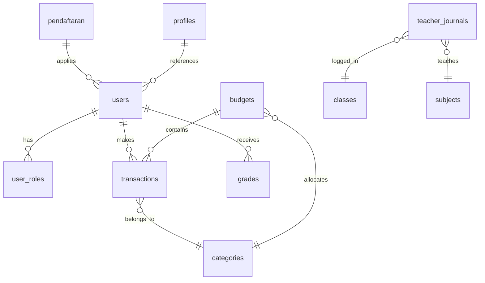

# Database Architecture

*Skema dan arsitektur database Supabase untuk sistem SMP Annida.*

## Table of Contents
1. [Deskripsi Tabel Utama](#deskripsi-tabel-utama)
2. [Diagram Entity-Relationship (ERD)](#diagram-entity-relationship-erd)
3. [Relasi & Foreign Key](#relasi--foreign-key)
4. [Row Level Security (RLS)](#row-level-security-rls)

---

## Deskripsi Tabel Utama

Sistem SMP Annida menggunakan PostgreSQL melalui Supabase. Berikut adalah tabel-tabel utama yang menangani tiga modul utama:

- **`users` (auth.users)**: Tabel bawaan Supabase Auth yang menyimpan kredensial autentikasi, email, dan identitas autentikasi utama.
- **`profiles`**: Tabel profil publik yang berelasi 1-to-1 dengan `auth.users`. Menyimpan nama lengkap, pengaturan aplikasi (seperti mata uang), profil whatsapp, dan URL avatar.
- **`user_roles`**: Mengatur hierarki hak akses (RBAC). Menentukan apakah pengguna adalah `admin`, `guru`, `keuangan`, atau `siswa`.
- **`transactions`**: Tabel modul keuangan yang mencatat semua transaksi pemasukan, pengeluaran, sumber dana, dan tanggal transaksi.
- **`budgets`**: Tabel alokasi anggaran bulanan untuk setiap kategori dalam modul keuangan.
- **`categories`**: Tabel kategori transaksi (mis. "Uang Gedung", "Gaji Guru").
- **`pendaftaran`**: Tabel dari modul PPDB (Penerimaan Peserta Didik Baru) yang berisi data calon siswa baru, asal sekolah, biodata wali, dan status pendaftaran.
- **`grades`**: Tabel nilai ujian dan rapor untuk setiap mata pelajaran per siswa dalam modul Akademik.
- **`class_schedules`**: Tabel penjadwalan akademik yang memetakan jam belajar, ruang kelas, guru pengajar, dan mata pelajaran.
- **`teacher_journals`**: Tabel log harian guru (Jurnal Guru) untuk merekam aktivitas belajar mengajar di kelas.

---

## Diagram Entity-Relationship (ERD)

Berikut adalah visualisasi hubungan antar tabel (fokus pada entitas utama):



*(Catatan: `users` mereferensikan tabel `auth.users` internal Supabase).*

---

## Relasi & Foreign Key

Semua entitas di atas dihubungkan secara ketat (relational) menggunakan Foreign Key untuk menjaga integritas data (Referential Integrity).
Contoh aturan relasi:
- `transactions.user_id` merujuk ke `auth.users.id`.
- `user_roles.user_id` merujuk ke `auth.users.id`.

### Contoh Query Penting
Untuk memanggil data transaksi khusus untuk pengguna yang sedang *login* saja:
```sql
SELECT * FROM transactions WHERE user_id = auth.uid();
```
Untuk mengecek apakah user yang sedang *login* memiliki *role* spesifik:
```sql
SELECT role FROM user_roles WHERE user_id = auth.uid();
```

---

## Row Level Security (RLS)

Seluruh tabel publik di atas dilindungi oleh kebijakan keamanan **Row Level Security (RLS)** bawaan PostgreSQL. RLS memastikan bahwa meskipun pengguna memiliki kredensial API, mereka tidak dapat membaca (SELECT), menambah (INSERT), mengubah (UPDATE), atau menghapus (DELETE) data milik entitas lain.

Data hanya bisa diakses apabila `auth.uid()` (ID milik token JWT pengguna) cocok dengan `user_id` / `teacher_id` pada *record* tersebut. Pengecualian diberikan pada administrator (ditentukan dari tabel `user_roles`).

> [!IMPORTANT]  
> Jika Anda menghapus dan melakukan deployment ulang ke *database* baru, Anda **Wajib** menjalankan skrip SQL kebijakan ini agar data tidak bocor.  
> Selengkapnya baca: [Security Documentation](security.md)
